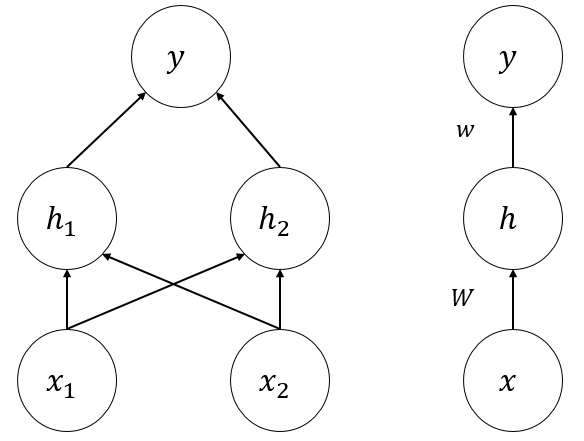

# 深度前馈网络笔记

**深度前馈网络(Deep Feedforward Network)**,也叫**做前馈神经网络(Feedforward Neural Network)**或者**多层感知器(Multi-Layer Perceptron, MLP)**.它是最典型的深度学习模型.是其它模型的基础.为了简便,下面我们以"前馈网络"来称呼它.

前馈网络本质就是一个分类器$y=f(x;\theta)$,将输入$x$映射到一个类别$y$.我们的目的是学习参数$\theta$,使模型能够进行最佳的预测.

前馈网络被称作"前馈"的原因是,输入$x$单向流过网络,最终产生输出.而被称作"网络",是因为模型通常使用许多不同函数复合在一起表示,例如$f(x)=f^{(3)}(f^{(2)}(f^{(1)}(x)))$.这样的链式结构是神经网络常用的结构.

其中,$f^{(1)}$被称为网络的第一层,$f^{(2)}$称为网络的第二层,$f^{(3)}$称为网络的**输出层**.链的长度叫做网络的**深度**.

在神经网络训练的过程中,我们让$f(x)$去匹配$f^*(x)$的值,$f^ *(x)$由训练数据提供,每个样本都伴随着一个标签$y$(在一些情况中,训练数据包含一些噪声点,所以实际上$y\approx f^ *(x)$).

训练样本告诉输出层,网络应该产生一个接近$y$的输出,但是训练样本不关心其它层应该这么做.学习算法必须自己学习到怎么调整其它层的行为以让$f$逼近$f^*$.因为训练数据并没有给出除了输出层以外层应该产生什么输出,所以这些层叫做**隐藏层**.

前馈网络受到神经科学的启发,按照神经元的方式构造网络.每一层包含了多个**单元**,每个单元表示一个向量到标量的函数,它接收的输入来源于其它许多单元,并计算它自己的激活值.

一个单元实际上就是一个线性模型.线性模型是一种非常不错的模型,它们能够高效且可靠地拟合,但是线性模型只能解决线性问题.而现实中大部分问题都是非线性的.

为了扩展线性模型来表示非线性函数,可以把线性模型作用于一个经过$\phi$变换后的结果上.即作用于$\phi(x)$上.这里的$\phi$是非线性的.深度学习,或者说神经网络的目的,就是去习得这个$\phi$.

## 从XOR认识前馈网络

XOR是一个简单但是颇具代表性的例子.XOR的输入$\mathbb{X}=\lbrace [ 0,0]^T, [ 0,1]^T, [1, 0]^T, [ 1,1]^T \rbrace$,它们对应的标签是:$\mathbb{Y}= \lbrace 0,1,1,0 \rbrace$.我们把这四个点画在坐标轴上面,会发现根本无法用一条直线去划分它们.也就是说无法用线性模型去解决问题.

我们需要引入一个非常简单的前馈网络,如下图所示:

这个网络有一层隐藏层,隐藏层保存向量$h$,这是通过线性模型得到的.输出层同样是线性模型,但是它现在使用$h$作为输入.

两个线性模型分别是:$h=f^{(1)}(x;W,c)$和$y=f^{(2)}(h;w,b)$.

但是如果两个都是线性模型,最终模型还是线性的,所以我们需要对隐藏层的输出做一定处理,使之变为非线性的.

这里采取的做法是在隐藏层的输出加上一个**激活函数**,把输出结果变为非线性的,即:$h=g(W^Tx+c)$.在现代神经网络中,一般使用ReLU函数作为隐藏层的激活函数,即:$g(z)=\max \lbrace 0,z \rbrace$.

现在,我们的整个网络是:

$$f(x;W,c,w,b)=w^T\max\lbrace0,W^Tx+c\rbrace+b$$

这个模型就可以很好地解决XOR问题.

那么,现在的问题就在于,如何设计一个算法,让模型根据输入的训练数据,自动训练这些参数了.

## 基于梯度训练前馈网络

使用梯度下降法训练前馈网络是一件非常简单而又传统的事情.在训练前,我们需要指定损失函数,训练时,需要指定一个优化器以及我们需要训练的模型.

但是和传统机器学习算法的区别是,因为神经网络都是非线性的,损失函数基本都是非凸的.我们无法使用传统的凸优化理论去训练参数(凸优化被大量应用于SVM,逻辑回归等机器学习算法).我们只能通过不断地迭代去逼近损失函数的最低值.

损失函数,优化器的选择都是需要在建模前完成的.优化器在这里仅仅涉及到梯度下降法.还有很多对梯度下降改进的优化器,在[优化方法笔记]()中,有关于这些改进优化器的介绍.

下面先来看损失函数的选择.

### 损失函数

### 输出单元

我们知道,前馈网络有一组隐藏输出$h=f(x;\theta)$(也叫隐藏特征),输出层的作用是对这些隐藏特征做一些额外的变换,得到最终的输出结果.

#### 线性单元

#### Sigmoid单元

#### Softmax单元
