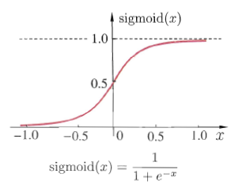

# 深度学习

**注意:请使用Chrome阅读并安装[Github with MathJax](https://chrome.google.com/webstore/detail/github-with-mathjax/ioemnmodlmafdkllaclgeombjnmnbima/related)插件,否则文中的数学公式无法显示!**

欢迎来到深度学习的神奇世界!

## 感知器

神经网络最基础的概念就是感知器.一个感知器实际上就是一个节点,它可以接受n个输入X,每个输入都有一个权重W.感知器将输入和权重相乘后加起来,得到一个结果.我们一般把这个结果叫做"得分".

对于这个结果,我们需要一个特殊的函数作用于它,然后产生的就是最终输出.这个函数叫做**激活函数**.激活函数用于把WX产生的结果转换为人们更加容易理解的输出结果.相当于把"得分"转换为"最终结果".一种激活函数是"阶跃函数",当x&gt;0,阶跃函数输出1;当x&lt;0,阶跃函数输出0.


注意一个特殊的输入和权值1和b.它们实际上构成了bias.bias能够控制感知器在什么时候能够"激活"(指的是感知器返回1).它实际上刻画了感知器的"敏感程度".bias也可以不写成权值和输入的形式,而作为感知器的一个属性保存在感知器内部.当bias越大,感知器越难被激活.

由此可见,感知器可以解决简单的"二分类"问题.那么现在的问题就是我们如何调整W使得感知器能够进行准确的分类.

在一开始,W是随机设置的,使用这样的感知器去对数据分类,必然会产生很大的误差,我们的目的就是尽可能最小化这个误差.那么在感知器算法中,如何定义这个误差并且最小化它就成为了很关键的一步.

在二分类问题中,误差可以简单地看作分类错误的点的数量.但是这个误差函数并不是连续的,我们就无法很好地使用梯度下降法(gradient decent)去最小化误差了(因为误差函数是不可微的).

**NOTES: 误差函数必须是连续可微的!**

## Sigmoid激活函数

为了使误差是连续可微的,我们就不能再使用阶跃函数这种只会产生0和1这种离散值的激活函数了.必须使用一个连续的激活函数.

这里引入Sigmoid函数,Sigmoid将很大的值输出为接近1的值,将很小的值输出为接近0的值.越接近0的值,Sigmoid将会给出越接近0.5的结果.



记:

$$\sigma(x)=\frac{1}{1+e^{-x}}$$

在二分类问题中,使用Sigmoid函数给出的结果并不是精确的分类,而是对分类的一个预测.如果结果越接近1,就表示感知器有更大的把握把该数据分为1类;越接近0,则有更大的把握分为0类别.

这样我们的误差函数就可以定义为: $E=(\hat{y}-y)^2$.其中$\hat{y}$表示感知器的输出,$y$表示正确的分类.因为使用sigmoid激活函数,所以$\hat{y}$是连续的,这样一来$E$也是连续的了.

## Softmax激活函数

在二分类问题中,使用sigmoid激活函数可以给出数据属于某一类别的概率.但是对于多分类问题,sigmoid函数产生的一个[0,1]的结果必然是不够的.

我们希望有这样一个激活函数: 它能告诉我们数据属于不同类别的概率分别是多少.这样我们就可以使用概率最高的那个类别作为预测结果了.

Softmax函数就是这种思想,它接收数据在不同类别的"评分"(这个评分实际上是由感知器算得的值),根据不同类别评分来计算出数据属于不同类别的概率,随后选择概率最大的那个类别作为输出结果.

一个softmax函数的python代码如下:

```python
import numpy as np
def softmax(L):
    # 对所有结果取exp以将负数转换为正数
    expL = np.exp(L)
    sumExpL = sum(expL)
    result = []
    for i in expL:
        result.append(i * 1.0 / sumExpL)
    return result
```

## 交叉熵 Cross Entropy

使用Sigmoid或Softmax激活函数可以求出一个数据属于各种类别的概率.我们同时知道该数据的正确类别,那么就知道了数据属于正确类别的概率.

根据最大似然法,我们希望最大化分类正确的概率.所以完全可以使用分类正确的概率作为误差函数.当然在我们的认知中,误差应该是要去最小化的,所以可以对分类正确的概率取-ln.这就得到了交叉熵.交叉熵越大,就表示正确分类的概率越小.

下面给出交叉熵的完整定义,对于一个二分类问题,假设$y$是数据的正确类别,它只能取0或1.$\hat{y}$是感知器给出的预测,它越接近1就表示数据属于正例的概率越高,m表示数据点的个数.那么交叉熵的计算公式为:

$$CE=-\sum^m_{i=1}y_iln(\hat{y}_i)+(1-y_i)ln(1-\hat{y}_i)$$

对于多分类问题,我们定义$\hat{y}_{ij}$为感知器输出的第$j$个数据属于类别$i$的概率.

$y_{ij}$等于1如果第$j$个数据属于$i$类,否则等于0,m表示有几个类别,n表示数据点的个数.那么多分类的交叉熵公式为:

$$CE=-\sum^m_{i=1}\sum^n_{j=1}y_{ij}ln(\hat{y}_{ij})$$

我们可以使用交叉熵作为神经网络的误差函数使训练更加符合概率论的理论.

## 梯度下降法 Gradient Descent

有了上面的交叉熵作为误差函数,我们就可以使用梯度下降法来最小化误差了.

注意我们现在面对的问题仍然是训练感知器使其能够正确地执行分类问题.也就是我们需要调整参数W和bias.

这里介绍梯度下降法,它的思想非常简单.我们现在的目标是最小化误差,使用随机的参数分类数据得到一个误差后,我们可以计算这个点在误差函数上的梯度,随后向梯度的方向调整参数,就可以实现对误差的减少.

以上的步骤多执行几次,我们可以让误差点逼近于误差函数的最小值或局部最小值,这样,就得到了一个较为完善的模型.

下面推导感知器学习中梯度下降法的完整数学过程:

首先,Sigmoid函数有一个非常好的求导特征:

$$\sigma\prime(x)=\sigma(x)(1-\sigma(x))$$

假设问题是一个二分类问题,如果有m个样本点(训练集),误差公式为:

$$E=-\frac{1}{m}\sum^m_{i=1}y^iln(\hat{y}^i)+(1-y^i)ln(1-\hat{y}^i)$$

$\hat{y}^i$表示预测值,在感知器算法中,它的计算公式如下:

$$\hat{y}^i=\sigma(Wx^i+b)$$

我们需要计算每一个$w^i$关于误差$E$的梯度,从而对参数进行调整.这里需要求:

$$
\begin{aligned}
    \frac{\partial}{\partial{w_j}}\hat{y}&=\frac{\partial}{\partial{w_j}}\sigma(Wx+b)\\
    &=\sigma(Wx+b)(1-\sigma(Wx+b))\cdot\frac{\partial}{\partial{w_j}}(Wx+b)\\
    &=\hat{y}(1-\hat{y}) \cdot x_i
\end{aligned}
$$

有了上面的式子,我们可以对误差$E$求导:

$$

\begin{aligned}
    \frac{\partial}{\partial{w_j}}E&=\frac{\partial}{\partial{w_j}}(-\frac{1}{m}\sum^m_{i=1}y_ilog(\hat{y}_i)+(1-y_i)log(1-\hat{y}_i))\\
    &=-\frac{1}{m}\sum^m_{i=1}y_i\frac{\partial}{\partial{w_j}}log(\hat{y}_i)+(1-y_i)\frac{\partial}{\partial{w_j}}log(1-\hat{y}_i)\\
    &=-\frac{1}{m}\sum^m_{i=1}y_i(1-\hat{y}_i)x^{(i)}_j-(1-y_i)\hat{y}_ix^{(i)}_j\\
    &=-\frac{1}{m}\sum^m_{i=1}(y_i-\hat{y}_i)x^{(i)}_j
\end{aligned}

$$

注意上面的$x^{(i)}_j$表示第
