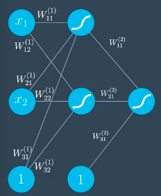
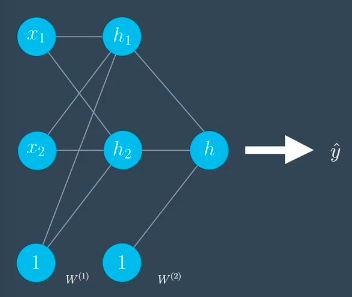

# 深度学习

**注意:请使用Chrome阅读并安装[Github with MathJax](https://chrome.google.com/webstore/detail/github-with-mathjax/ioemnmodlmafdkllaclgeombjnmnbima/related)插件,否则文中的数学公式无法显示,除非你愿意读原始Latex代码_(:з」∠)_**

欢迎来到深度学习的神奇世界!

## 感知器

神经网络最基础的概念就是感知器.一个感知器实际上就是一个节点,它可以接受n个输入X,每个输入都有一个权重W.感知器将输入和权重相乘后加起来,得到一个结果.我们一般把这个结果叫做"得分".

对于这个结果,我们需要一个特殊的函数作用于它,然后产生的就是最终输出.这个函数叫做**激活函数**.激活函数用于把WX产生的结果转换为人们更加容易理解的输出结果.相当于把"得分"转换为"最终结果".一种激活函数是"阶跃函数",当x&gt;0,阶跃函数输出1;当x&lt;0,阶跃函数输出0.


注意一个特殊的输入和权值1和b.它们实际上构成了bias.bias能够控制感知器在什么时候能够"激活"(指的是感知器返回1).它实际上刻画了感知器的"敏感程度".bias也可以不写成权值和输入的形式,而作为感知器的一个属性保存在感知器内部.当bias越大,感知器越难被激活.

由此可见,感知器可以解决简单的"二分类"问题.那么现在的问题就是我们如何调整W使得感知器能够进行准确的分类.

在一开始,W是随机设置的,使用这样的感知器去对数据分类,必然会产生很大的误差,我们的目的就是尽可能最小化这个误差.那么在感知器算法中,如何定义这个误差并且最小化它就成为了很关键的一步.

在二分类问题中,误差可以简单地看作分类错误的点的数量.但是这个误差函数并不是连续的,我们就无法很好地使用梯度下降法(gradient decent)去最小化误差了(因为误差函数是不可微的).

**NOTES: 误差函数必须是连续可微的!**

## Sigmoid激活函数

为了使误差是连续可微的,我们就不能再使用阶跃函数这种只会产生0和1这种离散值的激活函数了.必须使用一个连续的激活函数.

这里引入Sigmoid函数,Sigmoid将很大的值输出为接近1的值,将很小的值输出为接近0的值.越接近0的值,Sigmoid将会给出越接近0.5的结果.


记:

$$\sigma(x)=\frac{1}{1+e^{-x}}$$

在二分类问题中,使用Sigmoid函数给出的结果并不是精确的分类,而是对分类的一个预测.如果结果越接近1,就表示感知器有更大的把握把该数据分为1类;越接近0,则有更大的把握分为0类别.

这样我们的误差函数就可以定义为: $E=(\hat{y}-y)^2$.其中$\hat{y}$表示感知器的输出,$y$表示正确的分类.因为使用sigmoid激活函数,所以$\hat{y}$是连续的,这样一来$E$也是连续的了.

## Softmax激活函数

在二分类问题中,使用sigmoid激活函数可以给出数据属于某一类别的概率.但是对于多分类问题,sigmoid函数产生的一个[0,1]的结果必然是不够的.

我们希望有这样一个激活函数: 它能告诉我们数据属于不同类别的概率分别是多少.这样我们就可以使用概率最高的那个类别作为预测结果了.

Softmax函数就是这种思想,它接收数据在不同类别的"评分"(这个评分实际上是由感知器算得的值),根据不同类别评分来计算出数据属于不同类别的概率,随后选择概率最大的那个类别作为输出结果.

一个softmax函数的python代码如下:

```python
import numpy as np
def softmax(L):
    # 对所有结果取exp以将负数转换为正数
    expL = np.exp(L)
    sumExpL = sum(expL)
    result = []
    for i in expL:
        result.append(i * 1.0 / sumExpL)
    return result
```

## 交叉熵 Cross Entropy

使用Sigmoid或Softmax激活函数可以求出一个数据属于各种类别的概率.我们同时知道该数据的正确类别,那么就知道了数据属于正确类别的概率.

根据最大似然法,我们希望最大化分类正确的概率.所以完全可以使用分类正确的概率作为误差函数.当然在我们的认知中,误差应该是要去最小化的,所以可以对分类正确的概率取-ln.这就得到了交叉熵.交叉熵越大,就表示正确分类的概率越小.

下面给出交叉熵的完整定义,对于一个二分类问题,假设$y$是数据的正确类别,它只能取0或1.$\hat{y}$是感知器给出的预测,它越接近1就表示数据属于正例的概率越高,m表示数据点的个数.那么交叉熵的计算公式为:

$$CE=-\sum^m_{i=1}y_iln(\hat{y}_i)+(1-y_i)ln(1-\hat{y}_i)$$

对于多分类问题,我们定义$\hat{y}_{ij}$为感知器输出的第$j$个数据属于类别$i$的概率.

$y_{ij}$等于1如果第$j$个数据属于$i$类,否则等于0,m表示有几个类别,n表示数据点的个数.那么多分类的交叉熵公式为:

$$CE=-\sum^m_{i=1}\sum^n_{j=1}y_{ij}ln(\hat{y}_{ij})$$

我们可以使用交叉熵作为神经网络的误差函数使训练更加符合概率论的理论.

## 梯度下降法 Gradient Descent

有了上面的交叉熵作为误差函数,我们就可以使用梯度下降法来最小化误差了.

注意我们现在面对的问题仍然是训练感知器使其能够正确地执行分类问题.也就是我们需要调整参数W和bias.

这里介绍梯度下降法,它的思想非常简单.我们现在的目标是最小化误差,使用随机的参数分类数据得到一个误差后,我们可以计算这个点在误差函数上的梯度,随后向梯度的方向调整参数(实际上就是用参数减去算得的梯度),就可以实现对误差的减少.

以上的步骤多执行几次,我们可以让误差点逼近于误差函数的最小值或局部最小值,这样,就得到了一个较为完善的模型.

下面推导感知器学习中梯度下降法的完整数学过程:

首先,Sigmoid函数有一个非常好的求导特征:

$$\sigma\prime(x)=\sigma(x)(1-\sigma(x))$$

假设问题是一个二分类问题,如果有m个样本点(训练集),误差公式为:

$$E=-\frac{1}{m}\sum^m_{i=1}y^iln(\hat{y}^i)+(1-y^i)ln(1-\hat{y}^i)$$

$\hat{y}^i$表示预测值,在感知器算法中,它的计算公式如下:

$$\hat{y}^i=\sigma(Wx^i+b)$$

我们需要计算每一个$w^i$关于误差$E$的梯度,从而对参数进行调整.这里需要求:


有了上面的式子,我们可以对误差$E$求导:


类似可以计算出bias的梯度:

$$\frac{\partial}{\partial{b}}E=\frac{1}{m}\sum^m_{i=1}(y_i-\hat{y}_i)$$

通过上面的推导,我们可以知道:对于一个点$(x_1,x_2,\dots,x_n)$,标签为$y$,感知器预测为$\hat{y}$.那么该点的误差函数梯度为:

$$-(y-\hat{y})(x_1,x_2,\dots,x_n,1)$$

现在,我们能够写出梯度下降的代码了:

```python
# Implement of Gradient Desent for Sensor Algorithm.

import numpy as np
# Activation function
def sigmoid(x):
    return 1 / (1 + np.exp(-x))

# final output
def output_formula(features, weights, bias):
    return sigmoid(np.dot(features, weights) + bias)

# Use final output to calculate error.
def error_formula(y, output):
    return - y * np.log(output) - (1 - y) * np.log(1 - output)

# Use Gradient Desent to update weights.
def update_weights(x, y, weights, bias, alpha):
    output = output_formula(x, weights, bias)
    error = -(y - output)
    weights -= alpha * error * x
    bias -= alpha * error
    return weights, bias
```

上面是核心的辅助函数,可以帮助感知器完成训练.其中alpha表示学习率,范围在[0,1]之间,alpha越大,学习速度越快.适当减少alpha可以在一定程度上避免过拟合.

在真正训练的时候,需要不断地对weights和bias调用update_weights更新.具体次数通过epochs控制.

另外要注意的是,我们在训练的时候得到的是多组梯度(每个点都可以产生一组梯度),一般情况下,我们可以去这些梯度的均值作为最终的梯度结果.

一份简单的训练代码如下:

```python
import numpy as np
# Train Sensor.
def train(features, targets, epochs, alpha):
    errors = []
    n_records, n_features = features.shape
    # Randomly initialize weights.
    weights = np.random.normal(scale=(1 / n_features**.5), size=n_features)
    bias = 0
    for i in range(epochs):

        for x, y in zip(features, targets):
            output = output_formula(x, weights, bias)
            error = error_formula(y, output)
            weights, bias = update_weights(x, y, weights, bias, alpha)

```

## 神经网络 Neural Network

感知器模型能够很好地解决线性分类问题,但是真实世界的环境往往比线性分类要复杂得多.要解决更加复杂的,非线性的问题,就要引入我们深度学习的主角了: 神经网络.

神经网络这个概念来源于生物学.大脑中的神经网络由几乎无数多个神经元构成.神经元之间通过突触连接在一起.当一个神经元"兴奋"时,它可以把这种"兴奋"通过突触传递给其它神经元.

AI中的神经网络概念类似,但是它更加"数学化".AI中的神经元就是我们上面介绍的感知器,但是这个感知器的权值不再是简单地接受输入了,而可以连接着其它更多的感知器.当一个感知器被"激活"(通过激活函数,权重,输入,bias计算结果)时,它能把结果传给其它更多的感知器.

这样一来,通过多层感知器构成的人工神经网络(这种叫法是为了区别生物中的神经网络,但是因为本文不涉及生物,所以下面都简称神经网络),就能够解决非常复杂的非线性问题了.

一个神经网络的具体结构如下:


这是一种层级的结构.注意,并不是所有神经网络都采用这种结构,现在有更多先进的结构如CNN,RNN(后面会介绍),但这是最简单的,最容易入门的结构.

每层由多个感知器构成,层内部的感知器是不相连的,但是层之间的感知器是"密集连接"的.

这种结构有3种层:

- 输入层(Input Layer): 用于接受输入数据,然后传递给Hidden Layer.输入层一般不进行运算.
- 隐藏层(Hidden Layer): 最主要的"功能层".接收来自输入层的数据并进行计算,然后将结果传给输出层进行输出.隐藏层可以有多层(隐藏层之间也是密集连接的).一般来说,隐藏层越多,神经网络就越强大.
- 输出层(Output Layer): 接收隐藏层的计算结果,整合之后进行输出.对于分类任务来说,使用Softmax激活函数,一般有多少目标类别,输出层就有多少个感知器,每个感知器输出的是数据属于这个类别的概率.

为什么这样整合就能产生复杂的模型呢?实际上每个感知器仍然在做简单的线性分类,它们只能提取数据的一些简单的特征.但是通过多个隐藏层已经输出层的整合,最终就能产生非线性模型,下面的图可以有助于理解:


现实中的一些复杂的问题如图像识别,无人车驾驶等,就可以通过增加大量的隐藏层来实现训练.当隐藏层足够多,模型足够复杂,我们就称这种训练为**深度学习**了.

现在,我们已经了解了什么叫做神经网络,下面研究怎么去训练它.

训练神经网络和训练感知器的思路是一样的,我们需要训练所有的权值W和偏差Bias.只不过,神经网络的参数比感知器要多得多.但是我们仍然可以用训练数据去计算误差函数的梯度,然后使用梯度来反过来调整参数.

### 前向反馈 Feed Forward

为了训练神经网络,我们首先需要了解它怎么将一个输入数据转换为输出.

对于下面的一个神经网络(Bias作为感知器):



我们使用矩阵来表示它的权重和输入:


现在,可以通过矩阵运算求得最终结果:

$$\hat{y}=\sigma(W^{(2)}\sigma(W^{(1)T} \cdot X))$$

因为$W^{(1)}$是一个3x2矩阵,X是3x1矩阵,无法直接相乘,所以$W^{(1)}$需要转置.

有了$\hat{y}$,我们就可以根据$y$来求得误差函数了.多层感知器的误差函数和之前的单个感知器的误差函数是一样的(具体公式参见之前"交叉熵"的部分).

### 反向传播 Back Propagation

反向传播是训练神经网络最重要的方法,英文为BackPropagation.用BP算法训练出来的神经网络被叫做BP神经网络.

BP算法的思想其实很好理解,其核心思想也是对误差进行梯度下降来调整参数,其步骤如下:

- 进行前向反馈(Feed Forward),算出$\hat{y}$
- 比较$\hat{y}$和$y$,计算误差
- 向后将误差分散到每个权重之上
- 运用误差更新每个权重
- 重复上述步骤,直到误差收敛

首先,我们整理之前学的但是要在BP算法中用到的公式:

单隐藏层神经网络的预测结果为:

$$\hat{y}=\sigma(W^{(2)}\sigma(W^{(1)T} \cdot X))$$

误差函数为:

$$E(W)=-\frac{1}{m}\sum^m_{i=1}y_iln(\hat{y}_i)+(1-y_i)ln(1-\hat{y}_i)$$

对于单个感知器,误差函数的梯度表示为:

$$\nabla E=(\frac{\partial E}{\partial w_1},\frac{\partial E}{\partial w_2},\dots,\frac{\partial E}{\partial w_n}, \frac{\partial E}{\partial b})$$

但是在神经网络中,w多了很多,下面是简化表示:

$$\nabla E=(\dots,\frac{\partial E}{\partial w_j^{(i)}}, \dots)$$

我们可以把误差梯度写成矩阵的形式:

$$\nabla E=(\frac{\partial E}{\partial W^{(1)}},\frac{\partial E}{\partial W^{(2)}},\dots,\frac{\partial E}{\partial W^{(n)}})$$

对于某个权重的更新,方法和训练感知器是一样的:

$$w^{(k)}=w^{(k)}-\alpha\frac{\partial E}{\partial w^{(k)}}$$

现在我们假设我们的神经网络是下面这样的:



我们可以直接书写出每个h的表达式:

$$h_1=W^{(1)}_{11}x_1+W^{(1)}_{21}x_2+W^{(1)}_{31}$$

$$h_2=W^{(1)}_{12}x_1+W^{(1)}_{22}x_2+W^{(1)}_{32}$$

$$h=W^{(2)}_{11}\sigma(h_1)+W^{(2)}_{21}\sigma(h_2)+W^{(2)}_{31}$$

$$\hat{y}=\sigma(h)$$

我们需要计算$\frac{\partial E}{\partial W^{(k)}_{ij}}$.

单独计算对$W^{(1)}_{11}$的偏导数(使用链式求导法则):

$$\frac{\partial E}{\partial W^{(1)}_{11}}=\frac{\partial E}{\partial \hat{y}}\frac{\partial \hat{y}}{\partial h}\frac{\partial h}{\partial h_1}\frac{\partial h_1}{\partial W_{11}^{(1)}}$$

因为篇幅原因,具体的求导我这里不再演算了(直接通过上面给的表达式求导即可),详情可以看西瓜书.

对每个$W$求导,就可以求出所有参数的梯度,随后就可以执行梯度下降了.
