# 深度学习

**注意:请使用Chrome阅读并安装[Github with MathJax](https://chrome.google.com/webstore/detail/github-with-mathjax/ioemnmodlmafdkllaclgeombjnmnbima/related)插件,否则文中的数学公式无法显示,除非你愿意读原始Latex代码_(:з」∠)_**

欢迎来到深度学习的神奇世界!

**目录**:

<!-- TOC -->

- [深度学习](#%E6%B7%B1%E5%BA%A6%E5%AD%A6%E4%B9%A0)
    - [感知器](#%E6%84%9F%E7%9F%A5%E5%99%A8)
    - [Sigmoid激活函数](#sigmoid%E6%BF%80%E6%B4%BB%E5%87%BD%E6%95%B0)
    - [Softmax激活函数](#softmax%E6%BF%80%E6%B4%BB%E5%87%BD%E6%95%B0)
    - [交叉熵 Cross Entropy](#%E4%BA%A4%E5%8F%89%E7%86%B5-cross-entropy)
    - [梯度下降法 Gradient Descent](#%E6%A2%AF%E5%BA%A6%E4%B8%8B%E9%99%8D%E6%B3%95-gradient-descent)
    - [神经网络 Neural Network](#%E7%A5%9E%E7%BB%8F%E7%BD%91%E7%BB%9C-neural-network)
        - [前向反馈 Feed Forward](#%E5%89%8D%E5%90%91%E5%8F%8D%E9%A6%88-feed-forward)
        - [反向传播 Back Propagation](#%E5%8F%8D%E5%90%91%E4%BC%A0%E6%92%AD-back-propagation)
    - [过拟合](#%E8%BF%87%E6%8B%9F%E5%90%88)
        - [早期停止](#%E6%97%A9%E6%9C%9F%E5%81%9C%E6%AD%A2)
        - [正则化](#%E6%AD%A3%E5%88%99%E5%8C%96)
        - [Dropout](#dropout)
    - [ReLU激活函数](#relu%E6%BF%80%E6%B4%BB%E5%87%BD%E6%95%B0)
    - [随机梯度下降](#%E9%9A%8F%E6%9C%BA%E6%A2%AF%E5%BA%A6%E4%B8%8B%E9%99%8D)
    - [学习速率](#%E5%AD%A6%E4%B9%A0%E9%80%9F%E7%8E%87)
    - [动量](#%E5%8A%A8%E9%87%8F)
    - [TensorFlow 入门](#tensorflow-%E5%85%A5%E9%97%A8)
        - [Tensor](#tensor)
        - [Session](#session)
        - [输入](#%E8%BE%93%E5%85%A5)
        - [线性模型(单感知器)](#%E7%BA%BF%E6%80%A7%E6%A8%A1%E5%9E%8B%E5%8D%95%E6%84%9F%E7%9F%A5%E5%99%A8)
        - [Softmax](#softmax)
        - [交叉熵](#%E4%BA%A4%E5%8F%89%E7%86%B5)
        - [Mini Batch](#mini-batch)
        - [实现两层网络](#%E5%AE%9E%E7%8E%B0%E4%B8%A4%E5%B1%82%E7%BD%91%E7%BB%9C)
        - [训练两层网络](#%E8%AE%AD%E7%BB%83%E4%B8%A4%E5%B1%82%E7%BD%91%E7%BB%9C)
        - [保存和读取模型](#%E4%BF%9D%E5%AD%98%E5%92%8C%E8%AF%BB%E5%8F%96%E6%A8%A1%E5%9E%8B)
        - [Tensorflow Dropout](#tensorflow-dropout)
    - [卷积神经网络 Convolutional Neural Network](#%E5%8D%B7%E7%A7%AF%E7%A5%9E%E7%BB%8F%E7%BD%91%E7%BB%9C-convolutional-neural-network)
        - [卷积层](#%E5%8D%B7%E7%A7%AF%E5%B1%82)
        - [Stride](#stride)
        - [池化层](#%E6%B1%A0%E5%8C%96%E5%B1%82)
        - [Keras实现CNN](#keras%E5%AE%9E%E7%8E%B0cnn)
            - [Keras 卷积层](#keras-%E5%8D%B7%E7%A7%AF%E5%B1%82)
            - [Keras 最大池化层](#keras-%E6%9C%80%E5%A4%A7%E6%B1%A0%E5%8C%96%E5%B1%82)
            - [CNN架构](#cnn%E6%9E%B6%E6%9E%84)
            - [图片增强](#%E5%9B%BE%E7%89%87%E5%A2%9E%E5%BC%BA)
        - [TensorFlow实现CNN](#tensorflow%E5%AE%9E%E7%8E%B0cnn)
        - [迁移学习](#%E8%BF%81%E7%A7%BB%E5%AD%A6%E4%B9%A0)
    - [循环神经网络 Recurrent Neural Network](#%E5%BE%AA%E7%8E%AF%E7%A5%9E%E7%BB%8F%E7%BD%91%E7%BB%9C-recurrent-neural-network)
        - [长短期记忆网络 LSTM](#%E9%95%BF%E7%9F%AD%E6%9C%9F%E8%AE%B0%E5%BF%86%E7%BD%91%E7%BB%9C-lstm)
        - [Word2vec](#word2vec)
    - [生成对抗网络Generative Adversarial Network](#%E7%94%9F%E6%88%90%E5%AF%B9%E6%8A%97%E7%BD%91%E7%BB%9Cgenerative-adversarial-network)
        - [深度卷积生成对抗网络](#%E6%B7%B1%E5%BA%A6%E5%8D%B7%E7%A7%AF%E7%94%9F%E6%88%90%E5%AF%B9%E6%8A%97%E7%BD%91%E7%BB%9C)
        - [半监督GAN模型](#%E5%8D%8A%E7%9B%91%E7%9D%A3gan%E6%A8%A1%E5%9E%8B)

<!-- /TOC -->

## 感知器

神经网络最基础的概念就是感知器.一个感知器实际上就是一个节点,它可以接受n个输入X,每个输入都有一个权重W.感知器将输入和权重相乘后加起来,得到一个结果.我们一般把这个结果叫做"得分".

对于这个结果,我们需要一个特殊的函数作用于它,然后产生的就是最终输出.这个函数叫做**激活函数**.激活函数用于把WX产生的结果转换为人们更加容易理解的输出结果.相当于把"得分"转换为"最终结果".一种激活函数是"阶跃函数",当x&gt;0,阶跃函数输出1;当x&lt;0,阶跃函数输出0.


注意一个特殊的输入和权值1和b.它们实际上构成了bias.bias能够控制感知器在什么时候能够"激活"(指的是感知器返回1).它实际上刻画了感知器的"敏感程度".bias也可以不写成权值和输入的形式,而作为感知器的一个属性保存在感知器内部.当bias越大,感知器越难被激活.

由此可见,感知器可以解决简单的"二分类"问题.那么现在的问题就是我们如何调整W使得感知器能够进行准确的分类.

在一开始,W是随机设置的,使用这样的感知器去对数据分类,必然会产生很大的误差,我们的目的就是尽可能最小化这个误差.那么在感知器算法中,如何定义这个误差并且最小化它就成为了很关键的一步.

在二分类问题中,误差可以简单地看作分类错误的点的数量.但是这个误差函数并不是连续的,我们就无法很好地使用梯度下降法(gradient decent)去最小化误差了(因为误差函数是不可微的).

**NOTES: 误差函数必须是连续可微的!**

## Sigmoid激活函数

为了使误差是连续可微的,我们就不能再使用阶跃函数这种只会产生0和1这种离散值的激活函数了.必须使用一个连续的激活函数.

这里引入Sigmoid函数,Sigmoid将很大的值输出为接近1的值,将很小的值输出为接近0的值.越接近0的值,Sigmoid将会给出越接近0.5的结果.


记:

$$\sigma(x)=\frac{1}{1+e^{-x}}$$

在二分类问题中,使用Sigmoid函数给出的结果并不是精确的分类,而是对分类的一个预测.如果结果越接近1,就表示感知器有更大的把握把该数据分为1类;越接近0,则有更大的把握分为0类别.

这样我们的误差函数就可以定义为: $E=(\hat{y}-y)^2$.其中$\hat{y}$表示感知器的输出,$y$表示正确的分类.因为使用sigmoid激活函数,所以$\hat{y}$是连续的,这样一来$E$也是连续的了.

## Softmax激活函数

在二分类问题中,使用sigmoid激活函数可以给出数据属于某一类别的概率.但是对于多分类问题,sigmoid函数产生的一个[0,1]的结果必然是不够的.

我们希望有这样一个激活函数: 它能告诉我们数据属于不同类别的概率分别是多少.这样我们就可以使用概率最高的那个类别作为预测结果了.

Softmax函数就是这种思想,它接收数据在不同类别的"评分"(这个评分实际上是由感知器算得的值),根据不同类别评分来计算出数据属于不同类别的概率,随后选择概率最大的那个类别作为输出结果.

一个softmax函数的python代码如下:

```python
import numpy as np
def softmax(L):
    # 对所有结果取exp以将负数转换为正数
    expL = np.exp(L)
    sumExpL = sum(expL)
    result = []
    for i in expL:
        result.append(i * 1.0 / sumExpL)
    return result
```

## 交叉熵 Cross Entropy

使用Sigmoid或Softmax激活函数可以求出一个数据属于各种类别的概率.我们同时知道该数据的正确类别,那么就知道了数据属于正确类别的概率.

根据最大似然法,我们希望最大化分类正确的概率.所以完全可以使用分类正确的概率作为误差函数.当然在我们的认知中,误差应该是要去最小化的,所以可以对分类正确的概率取-ln.这就得到了交叉熵.交叉熵越大,就表示正确分类的概率越小.

下面给出交叉熵的完整定义,对于一个二分类问题,假设$y$是数据的正确类别,它只能取0或1.$\hat{y}$是感知器给出的预测,它越接近1就表示数据属于正例的概率越高,m表示数据点的个数.那么交叉熵的计算公式为:

$$CE=-\sum^m_{i=1}y_iln(\hat{y}_i)+(1-y_i)ln(1-\hat{y}_i)$$

对于多分类问题,我们定义$\hat{y}_{ij}$为感知器输出的第$j$个数据属于类别$i$的概率.

$y_{ij}$等于1如果第$j$个数据属于$i$类,否则等于0,m表示有几个类别,n表示数据点的个数.那么多分类的交叉熵公式为:

$$CE=-\sum^m_{i=1}\sum^n_{j=1}y_{ij}ln(\hat{y}_{ij})$$

我们可以使用交叉熵作为神经网络的误差函数使训练更加符合概率论的理论.

## 梯度下降法 Gradient Descent

有了上面的交叉熵作为误差函数,我们就可以使用梯度下降法来最小化误差了.

注意我们现在面对的问题仍然是训练感知器使其能够正确地执行分类问题.也就是我们需要调整参数W和bias.

这里介绍梯度下降法,它的思想非常简单.我们现在的目标是最小化误差,使用随机的参数分类数据得到一个误差后,我们可以计算这个点在误差函数上的梯度,随后向梯度的方向调整参数(实际上就是用参数减去算得的梯度),就可以实现对误差的减少.

以上的步骤多执行几次,我们可以让误差点逼近于误差函数的最小值或局部最小值,这样,就得到了一个较为完善的模型.

下面推导感知器学习中梯度下降法的完整数学过程:

首先,Sigmoid函数有一个非常好的求导特征:

$$\sigma\prime(x)=\sigma(x)(1-\sigma(x))$$

假设问题是一个二分类问题,如果有m个样本点(训练集),误差公式为:

$$E=-\frac{1}{m}\sum^m_{i=1}y^iln(\hat{y}^i)+(1-y^i)ln(1-\hat{y}^i)$$

$\hat{y}^i$表示预测值,在感知器算法中,它的计算公式如下:

$$\hat{y}^i=\sigma(Wx^i+b)$$

我们需要计算每一个$w^i$关于误差$E$的梯度,从而对参数进行调整.这里需要求:


有了上面的式子,我们可以对误差$E$求导:

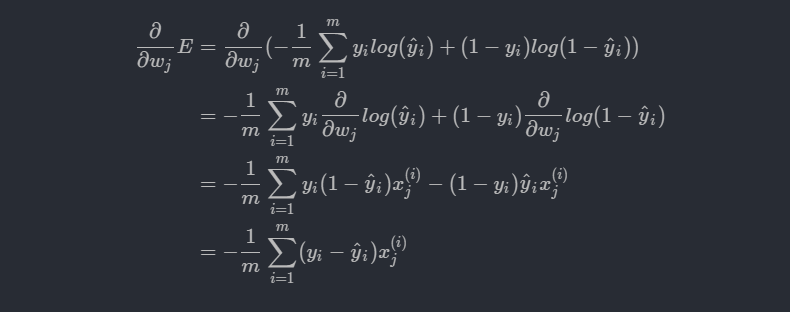

类似可以计算出bias的梯度:

$$\frac{\partial}{\partial{b}}E=\frac{1}{m}\sum^m_{i=1}(y_i-\hat{y}_i)$$

通过上面的推导,我们可以知道:对于一个点$(x_1,x_2,\dots,x_n)$,标签为$y$,感知器预测为$\hat{y}$.那么该点的误差函数梯度为:

$$-(y-\hat{y})(x_1,x_2,\dots,x_n,1)$$

现在,我们能够写出梯度下降的代码了:

```python
# Implement of Gradient Desent for Sensor Algorithm.

import numpy as np
# Activation function
def sigmoid(x):
    return 1 / (1 + np.exp(-x))

# final output
def output_formula(features, weights, bias):
    return sigmoid(np.dot(features, weights) + bias)

# Use final output to calculate error.
def error_formula(y, output):
    return - y * np.log(output) - (1 - y) * np.log(1 - output)

# Use Gradient Desent to update weights.
def update_weights(x, y, weights, bias, alpha):
    output = output_formula(x, weights, bias)
    error = -(y - output)
    weights -= alpha * error * x
    bias -= alpha * error
    return weights, bias
```

上面是核心的辅助函数,可以帮助感知器完成训练.其中alpha表示学习率,范围在[0,1]之间,alpha越大,学习速度越快.适当减少alpha可以在一定程度上避免过拟合.

在真正训练的时候,需要不断地对weights和bias调用update_weights更新.具体次数通过epochs控制.

另外要注意的是,我们在训练的时候得到的是多组梯度(每个点都可以产生一组梯度),一般情况下,我们可以去这些梯度的均值作为最终的梯度结果.

一份简单的训练代码如下:

```python
import numpy as np
# Train Sensor.
def train(features, targets, epochs, alpha):
    errors = []
    n_records, n_features = features.shape
    # Randomly initialize weights.
    weights = np.random.normal(scale=(1 / n_features**.5), size=n_features)
    bias = 0
    for i in range(epochs):

        for x, y in zip(features, targets):
            output = output_formula(x, weights, bias)
            error = error_formula(y, output)
            weights, bias = update_weights(x, y, weights, bias, alpha)

```

## 神经网络 Neural Network

感知器模型能够很好地解决线性分类问题,但是真实世界的环境往往比线性分类要复杂得多.要解决更加复杂的,非线性的问题,就要引入我们深度学习的主角了: 神经网络.

神经网络这个概念来源于生物学.大脑中的神经网络由几乎无数多个神经元构成.神经元之间通过突触连接在一起.当一个神经元"兴奋"时,它可以把这种"兴奋"通过突触传递给其它神经元.

AI中的神经网络概念类似,但是它更加"数学化".AI中的神经元就是我们上面介绍的感知器,但是这个感知器的权值不再是简单地接受输入了,而可以连接着其它更多的感知器.当一个感知器被"激活"(通过激活函数,权重,输入,bias计算结果)时,它能把结果传给其它更多的感知器.

这样一来,通过多层感知器构成的人工神经网络(这种叫法是为了区别生物中的神经网络,但是因为本文不涉及生物,所以下面都简称神经网络),就能够解决非常复杂的非线性问题了.

一个神经网络的具体结构如下:


这是一种层级的结构.注意,并不是所有神经网络都采用这种结构,现在有更多先进的结构如CNN,RNN(后面会介绍),但这是最简单的,最容易入门的结构.

每层由多个感知器构成,层内部的感知器是不相连的,但是层之间的感知器是"密集连接"的.

这种结构有3种层:

- 输入层(Input Layer): 用于接受输入数据,然后传递给Hidden Layer.输入层一般不进行运算.
- 隐藏层(Hidden Layer): 最主要的"功能层".接收来自输入层的数据并进行计算,然后将结果传给输出层进行输出.隐藏层可以有多层(隐藏层之间也是密集连接的).一般来说,隐藏层越多,神经网络就越强大.
- 输出层(Output Layer): 接收隐藏层的计算结果,整合之后进行输出.对于分类任务来说,使用Softmax激活函数,一般有多少目标类别,输出层就有多少个感知器,每个感知器输出的是数据属于这个类别的概率.

为什么这样整合就能产生复杂的模型呢?实际上每个感知器仍然在做简单的线性分类,它们只能提取数据的一些简单的特征.但是通过多个隐藏层已经输出层的整合,最终就能产生非线性模型,下面的图可以有助于理解:


现实中的一些复杂的问题如图像识别,无人车驾驶等,就可以通过增加大量的隐藏层来实现训练.当隐藏层足够多,模型足够复杂,我们就称这种训练为**深度学习**了.

现在,我们已经了解了什么叫做神经网络,下面研究怎么去训练它.

训练神经网络和训练感知器的思路是一样的,我们需要训练所有的权值W和偏差Bias.只不过,神经网络的参数比感知器要多得多.但是我们仍然可以用训练数据去计算误差函数的梯度,然后使用梯度来反过来调整参数.

### 前向反馈 Feed Forward

为了训练神经网络,我们首先需要了解它怎么将一个输入数据转换为输出.

对于下面的一个神经网络(Bias作为感知器):


我们使用矩阵来表示它的权重和输入:


现在,可以通过矩阵运算求得最终结果:

$$\hat{y}=\sigma(W^{(2)}\sigma(W^{(1)T} \cdot X))$$

因为$W^{(1)}$是一个3x2矩阵,X是3x1矩阵,无法直接相乘,所以$W^{(1)}$需要转置.

有了$\hat{y}$,我们就可以根据$y$来求得误差函数了.多层感知器的误差函数和之前的单个感知器的误差函数是一样的(具体公式参见之前"交叉熵"的部分).

### 反向传播 Back Propagation

反向传播是训练神经网络最重要的方法,英文为BackPropagation.用BP算法训练出来的神经网络被叫做BP神经网络.

BP算法的思想其实很好理解,其核心思想也是对误差进行梯度下降来调整参数,其步骤如下:

- 进行前向反馈(Feed Forward),算出$\hat{y}$
- 比较$\hat{y}$和$y$,计算误差
- 向后将误差分散到每个权重之上
- 运用误差更新每个权重
- 重复上述步骤,直到误差收敛

首先,我们整理之前学的但是要在BP算法中用到的公式:

单隐藏层神经网络的预测结果为:

$$\hat{y}=\sigma(W^{(2)}\sigma(W^{(1)T} \cdot X))$$

误差函数为:

$$E(W)=-\frac{1}{m}\sum^m_{i=1}y_iln(\hat{y}_i)+(1-y_i)ln(1-\hat{y}_i)$$

对于单个感知器,误差函数的梯度表示为:

$$\nabla E=(\frac{\partial E}{\partial w_1},\frac{\partial E}{\partial w_2},\dots,\frac{\partial E}{\partial w_n}, \frac{\partial E}{\partial b})$$

但是在神经网络中,w多了很多,下面是简化表示:

$$\nabla E=(\dots,\frac{\partial E}{\partial w_j^{(i)}}, \dots)$$

我们可以把误差梯度写成矩阵的形式:

$$\nabla E=(\frac{\partial E}{\partial W^{(1)}},\frac{\partial E}{\partial W^{(2)}},\dots,\frac{\partial E}{\partial W^{(n)}})$$

对于某个权重的更新,方法和训练感知器是一样的:

$$w^{(k)}=w^{(k)}-\alpha\frac{\partial E}{\partial w^{(k)}}$$

现在我们假设我们的神经网络是下面这样的:


我们可以直接书写出每个h的表达式:


我们需要计算$\frac{\partial E}{\partial W^{(k)}_{ij}}$.

单独计算对$W^{(1)}_{11}$的偏导数(使用链式求导法则):


这里的链式求导非常有意思,它实际上反映了一个"传播误差影响"的过程.

因为篇幅原因,具体的求导我这里不再演算了(直接通过上面给的表达式求导即可),详情可以看西瓜书.

对每个$W$求导,就可以求出所有参数的梯度,随后就可以执行梯度下降了.

## 过拟合

如果一个模型过于复杂,很容易出现过拟合的现象.对于神经网络这种复杂的模型,过拟合更加容易发生.下面介绍几种预防过拟合的方法.

### 早期停止

在训练神经网络的时候,Epoch是一个很重要的参数,Epoch越高,训练出来的模型越复杂.我们可以以Epoch为x轴,以误差为y轴,不断调整Epoch的值,绘制训练数据和验证数据的误差曲线.

在Epoch比较小的时候,模型偏向于随机猜测,因此训练集和验证集的误差应该比较接近,并且比较大.当Epoch不断增大,模型得到训练后,误差应该会不断减少.Epoch过大的时候,模型出现过拟合,这时候的特征是训练集的误差比较小,测试集的误差比较大,二者出现分离.

曲线的形状类似下面这样:


早期停止的目标在于找到一个适中的复杂的模型.这样的模型的训练集和验证集的准确度应该是相差不大的,但是整体的误差又较少.在上面的图中,只需要找到训练误差和验证误差刚开始分离的点.也就是Epoch为20的点.

### 正则化

我们同时希望训练出来的神经网络的权值不要太大,不然通过Sigmoid激活函数算出来的值可能会过于接近1或0.这也可能导致过拟合.更加严重的问题是,如果权值过大,将会导致输出函数过于陡峭,不利于进行梯度下降法调整参数.

我们可以对误差函数进行调整,以惩罚比较大的参数.

我们假定旧的误差参数为:

$$E=-\frac{1}{m}\sum^m_{i=1}y_iln(\hat{y}_i)+(1-y_i)ln(1-\hat{y}_i)$$

定义$\lambda$为惩罚系数(越大则对于越大的参数惩罚越大),则定义L1正则化为:

$$L_1=E+\lambda(|w_1|+\dots+|w_n|)$$

定义L2正则化为:

$$L_2=E+\lambda(w_1^2+\dots+w_n^2)$$

L1正则化得到的权值比较稀疏,较小的都趋向于0,较大的都趋向1,如果想要降低权重值,最终得到较少的结果,可以使用L1正则化.也就是说,在特征比较多的时候,我们希望神经网络给出一个比较确定的值,其余的都接近0,可以使用L1.

L2并不产生稀疏的权重,但是它保证权重都一致较小.也就是得出较小齐权向量.L2相比L1能够训练出表现更加好的模型.

### Dropout

有时候,训练出来的神经网络可能会出现"局部用力过猛"的现象.也就是说某些权重过大,而其余权值过小,过大的权值对训练结果起到了决定性作用,而较小的权值对训练结果几乎没有影响.

L2正则化可以在一定程度上解决这个问题,因为它能够得到一致小的权值.

另一种方案是Dropout,也就是在训练过程中,在某些Epoch中,把一些节点关闭,只训练局部的节点.这时候,其余的节点要承担起责任,在训练中起到更大的作用,得到更好的效果.

使用Dropout能够保证神经网络中所有的节点都得到充分的训练.

我们可以设置一个参数,这是一个概率,表示每个节点在每次Epoch中被放弃的概率.合理地设置这个值可以让训练出来的神经网络中的每个节点都起到一定的作用.

下图展示了Dropout的过程:

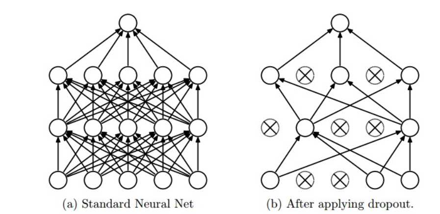

## ReLU激活函数

Sigmoid激活函数有一个问题,在某些点,其导数会非常小,例如:


而在梯度下降的链式求导中,我们会不断将这么小的导数相乘,最终得到的梯度就非常地小(几乎趋近于0).在这种情况下,梯度下降将会非常地慢,一次Epoch的训练效果极差.这个问题叫做**梯度消失**.

解决这个问题的一个手段是使用另外一个激活函数:ReLU(Rectified Linear Unit).

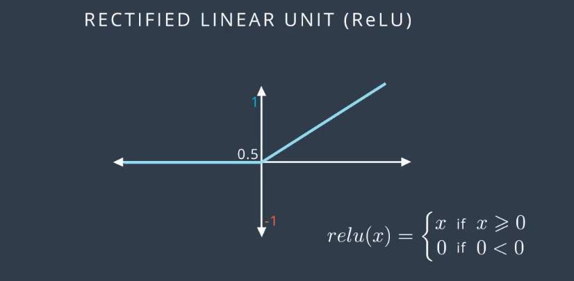

这个激活函数比Sigmoid更加通用,它能显著地改善训练效果,但是不会太牺牲准确性.因为如果数字是正数,导数为1.这样产生的梯度将会比Sigmoid大很多.

**NOTES:ReLU激活函数一般可以放在隐藏层中使用,而对于输出层,如果是二分类任务,则一般使用Sigmoid激活函数,如果是多分类任务,一般使用Softmax激活函数.**

## 随机梯度下降

在传统的梯度下降中,每个Epoch误差会减少误差的梯度,从而逼近梯度的局部最低点.然而,这意味对于每个权重都要进行大量的矩阵运算,会耗费大量的内存.如果神经网络比较复杂,权值很多,训练过程的计算量将会超乎想象.

随机梯度下降可以更快地计算出梯度值.它的思想非常简单,在每个Epoch中,我们只使用一部分数据进行前向反馈得到误差,并使用这个误差进行反向传递以更新权值.

我们可以把数据拆分为多个"批次".假如一个训练集有24个数据点,我们可以把它拆分为4批,每批6个点.每个Epoch使用其中的一批进行训练.

## 学习速率

如果学习速率很大,每次对权值的调整也会很大,模型可能会非常混乱,但是有更大的可能得到最优策略;如果学习速率很小,那么每次调整都会比较保守,最终收敛的概率更大,但是得到的可能并不是最优策略.

下面这张图显示了学习速率对于梯度下降的影响:


那么我们如何调整学习速率呢?一个好的准则是:如果最终模型不令人满意,可以尝试增大学习速率.

当然,我们也可以使用**随机重新开始**方法.这种方法从几个不同的随机点开始,分别进行梯度下降.这样可以增大得到全局最低点的概率.

## 动量

另外一个逼近误差全局最低点的方法是使用动量.动量可以帮助我们翻过一些局部最低点,从而找到误差的更低点.

在传统的梯度下降中,如果到达局部最低点,梯度已经下降到0了.我们就不可能翻越这个"山谷"了.情况类似下面这样:


我们希望在最低点能够继续前进一定程度的步长,从而能够翻过一些潜在的局部最低点.

一个解决方案是,在到达最低点后,让误差增大一个值,这个值和之前的步长有一定关系.离当前时间点越远的步长对这个值影响越小,越近的步长影响越大.

我们引入动量$\beta$,这是一个介于0和1之间的值,那么,在到达最低点之后,继续行走的步长为:

$$STEP=STEP(t)+\beta STEP(t-1)+\beta^2STEP(t-2)+\dots$$

这样,误差就可以翻越局部最低点了:


一个小问题是,在到达最低点之后,误差仍然会有一定的波动,但是这个波动不是很大,对最终结果并不会造成太大的影响.

在实际中,使用动量更有可能得到更加好的模型.

使用Python创建神经网络进行分类的传送门:

## TensorFlow 入门

使用Tensorflow可以很容易地用Python实现上面的神经网络.

在安装完TensorFlow之后,输入代码可以检测TensorFlow是否正常安装:

```python
import tensorflow as tf

hello_constant = tf.constant('Hello TensorFlow!')

with tf.Session() as sess:
    output = sess.run(hello_constant)
    print(output)

```

### Tensor

在TensorFlow中,数据不是以整数,浮点数或者字符串的形式储存的.这些值被封装在一个叫做tensor的对象中.在上面的hello程序中,hello_constant就是一个0维度的字符串tensor,tensor可以有很多不同的大小:

```python
# 0-dimensinal int32 tensor
a = tf.constant(1000)

# 1-dimensinal int32 tensor
b = tf.constant([1, 2, 3])

# 2-dimensinal int32 tensor
c = tf.constant([[1, 2, 3], [5, 6, 7]])

```

tf.constant()会返回一个常量tensor,这个tensor的值不能发生改变.

### Session

TensorFlow的api构建在computational graph的概念上,它是一种对数学运算过程进行可视化的方法.刚才的hello程序可以变为以下的图:

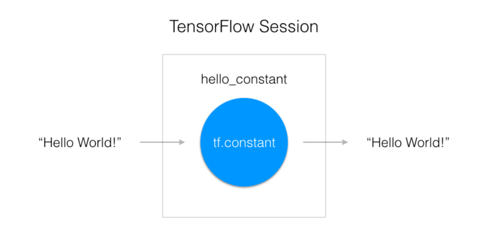

TensorFlow Session是用来运行图的环境.这个session负责分配GPU(s)或CPU(s),包括远程计算机的运算,使用的基本方法是:

```python
with tf.Session() as sess:
    output = sess.run(tensor)
```

tensor是之前已经创建好的Tensor对象.使用sess.run()函数可以对tensor进行求值,并返回结果.

Tensorflow编程的核心思想是,先构建运算graph,也就是Tensor之间的运算关系.这时候,Tensor并没有真正地求值,只有在tf.run()之后,Tensorflow才会执行这个graph,真正地对Tensor进行求值.这样的编程模式有点类似于Spark的RDD编程.

### 输入

tf.placeholder()可以产生一个常量的Tensor,但是可以在Session启动之后再赋值.可以通过sess.run()中的feed_dict参数设置.

注意一点,tf.placeholder()产生的Tensor是在Session创建之后再赋值的.初始化的时候仅需要指定它的类型.

```python
import tensorflow as tf

x = tf.placeholder(tf.string)

with tf.Session() as sess:
    output = sess.run(x, feed_dict={x: "Hello Tensorflow!"})
    print(output)
```

我们也可以在feed_dict中设置多个Tensor:

```python
import tensorflow as tf

x = tf.placeholder(tf.string)
y = tf.placeholder(tf.int32)
z = tf.placeholder(tf.float32)

with tf.Session() as sess:
    output = sess.run(x, feed_dict={x: 'Test string', y: 12, z: 1.2})
    print(output)

```

注意如果Tensor的类型和传入的值类型不一样,TensorFlow会报错.

### 线性模型(单感知器)

神经网络中最常见的计算,就是计算输入,权重和偏差的线性组合.我们通常把线性运算的输出写为:

$$y=Wx+b$$

训练神经网络的目的是更新权重和偏差来更好地预测目标.为了更新,需要一个能修改的Tensor.这就需要tf.Variable了.

tf.Variable可以创建一个可变值的Tensor,就像Python的普通变量一样.该tensor把状态存在session里面,所以必须手动初始化它的状态.我们可以使用tf.global_variables_initializer()函数来初始化所以可变tensor.

以下的代码创建Variable并且初始化:

```python
x = tf.Variable(5)

with tf.Session() as sess:
    sess.run(tf.global_variable_initializer())
```

tf.global_variables_initializer()会返回一个操作,它会从graph中初始化所有的Tensorflow变量.可以通过session来调用这个操作初始化所有上面的变量.

线性回归需要用到权重,我们一般从正态分布中取随机数来初始化权重.tf.truncated_normal()返回一个tensor,它的随机值取自一个正态分布.

bias一般初始化为0,使用tf.zeros()可以返回一个初值全部是0的Tensor.

在使用Tensorflow构建一个线性模型并训练的过程中,我们需要定义下列Tensor:

- 训练数据和测试数据
- 参数,这里指的是weights和bias
- 模型的计算过程,可以使用Tensorflow计算公式完成,输出叫做logit
- 损失,定义在训练的时候使用什么标准作为模型误差的衡量工具.一般使用交叉熵(后面会介绍)
- 优化器,定义在训练过程中怎么减少损失优化模型.一般使用梯度下降优化器(Tensorflow有提供,需要传入学习速率和要最小化的损失).

一个使用Tensorflow进行线性回归并且对著名的MNIST数据集中0,1,2进行分类的例子:[Tensorflow实现线性回归](https://github.com/LovelyLazyCat/ai/blob/master/deeplearning/tensorflow_test/linear_regression.py).

### Softmax

Softmax可以把它的输入,通常称为logits或者logit scores,处理成0到1之间的数字,并且能够把输出的和归一化为1.这意味softmax函数与分类的概率分布等价.在多分类任务中,它是一个优秀的激活函数.


在Tensorflow中使用softmax函数是非常简单的,下面是一个示例:

```python
import tensorflow as tf

logit_data = [2.0, 1.0, 0.1]

logits = tf.placeholder(tf.float32)

softmax = tf.nn.softmax(logits)

with tf.Session() as sess:
    output = sess.run(softmax, feed_dict={logits: logit_data})
    print(output)
```

### 交叉熵

在Tensorflow中实现交叉熵也是非常简单的.我们需要知道数据的原始one-hot编码和预测值(一般是由softmax函数得出的概率).来计算交叉熵.

Tensorflow并没有提供直接的交叉熵计算函数,但是我们可以通过其它数学函数来简单地组合一下:

```python
import tensorflow as tf

softmax_data = [0.7, 0.2, 0.1]
one_hot_data = [1.0, 0.0, 0.0]

softmax = tf.placeholder(tf.float32)
one_hot = tf.placeholder(tf.float32)

cross_entropy = tf.reduce_sum(tf.multiply(one_hot, tf.log(softmax)))

with tf.Session() as sess:
    output = sess.run(cross_entropy, feed_dict={softmax: softmax_data,
                                                one_hot: one_hot_data})
    print(output)
```

其中,reduce_sum输入一个序列,返回它们的和.

### Mini Batch

Mini Batch是一个一次训练数据集的一小部分,而不是整个训练集的技术.它可以使内存较小,不能同时训练整个训练集的电脑也可以训练模型.

它的代价是不能使用所有训练集来计算loss,但是这点代价对于完全无法计算来说还是微不足道的.

它和随机梯度下降(SGD)结合在一起也很有帮助.方法是在每一次训练之前,对数据进行混洗,然后创建mini-batches,对每一个mini-batch,用梯度下降训练网络权重.

在数据量很大的时候,mini-batch变得非常有意义.

我们可以这么做,假设有n_input个特征,有n_classes个可能的标签.可以使用[None, n_input]作为features的维度;[None, n_classes]作为labels的维度.

None维度在这里是一个batch size占位符.在运行时,Tensorflow会接收任何大于0的batch size.

下面对features和labels实现一个batches函数.这个函数返回每个有最大batch_size数据点的batch.例如,假如我们有4个数据点,batch_size为3.那么第一个batch长度为3,第二个为1.

```python
def batches(batch_size, features, labels):
    """
    Create batches of features and labels

    :param batch_size: the batch size(max)
    :param features: list of features.
    :param labels: list of labels
    :return: Batches of (features, labels)
    """
    assert len(features) == len(labels)

    output = []

    for start in range(0, len(features), batch_size):
        end = start + batch_size
        batch = [features[start:end], labels[start:end]]
        output.append(batch)

    return output
```

下面在Tensorflow中,对MNIST数据进行Mini-Batch操作并训练(使用线性模型):

```python
from tensorflow.examples.tutorials.mnist import input_data
import tensorflow as tf
import numpy as np

learning_rate = 0.001
n_input = 784
n_classes = 10

# origin mnist data
mnist = input_data.read_data_sets('/datasets/ud730/mnist', one_hot=True)

# features data
train_features = mnist.train.images
test_features = mnist.test.images

# labels data
train_labels = mnist.train.labels.astype(np.float32)
test_labels = mnist.test.labels.astype(np.float32)

# features and labels Tensor
# The first dimension is None to save the batch size.
features = tf.placeholder(tf.float32, [None, n_input])
labels = tf.placeholder(tf.float32, [None, n_classes])

# Initialize weights and bias
weights = tf.Variable(tf.random_normal([n_input, n_classes]))
bias = tf.Variable(tf.random_normal([n_classes]))

# Linear Model
logits = tf.add(tf.matmul(features, weights), bias)

# Define loss and optimizer.
cost = tf.reduce_mean(tf.nn.softmax_cross_entropy_with_logits(logits=logits, labels=labels))
optimizer = tf.train.GradientDescentOptimizer(learning_rate=learning_rate).minimize(cost)

# Calculate accuracy
correct_prediction = tf.equal(tf.argmax(logits, 1), tf.argmax(labels, 1))
accuracy = tf.reduce_mean(tf.cast(correct_prediction, tf.float32))

batch_size = 128

init = tf.global_variables_initializer()

with tf.Session() as sess:
    sess.run(init)

    for batch_features, batch_label in batches(batch_size, train_features, train_labels):
        sess.run(optimizer, feed_dict={features: batch_features, labels: batch_label})

    test_accuracy = sess.run(accuracy, feed_dict={features: test_features, labels: test_labels})

print("test accuracy: {}".format(test_accuracy))
```

### 实现两层网络

通过上面的线性模型,我们可以简单地实现单层感知器模型.对于多层感知器模型,也就是多层神经网络,利用Tensorflow也可以简单地实现.

对于一个神经网络,输出层的激活函数一般是Sigmoid或Softmax.但是,隐藏层的激活函数一般使用ReLU比较好(为了避免梯度消失),Tensorflow直接提供了ReLU激活函数,可以直接把多个线性感知器连接起来:

```python
hidden_layer = tf.add(tf.matmul(features, hidden_weights), hidden_biases)
hidden_layer = tf.nn.relu(hidden_layer)
```

我们可以通过下面的代码把一个线性单层网络变成一个双层的非线性网络:

```python
import tensorflow as tf

output = None

hidden_layer_weights = [
    [0.1, 0.2, 0.4],
    [0.4, 0.6, 0.6],
    [0.5, 0.9, 0.1],
    [0.8, 0.2, 0.8]
]

out_weights = [
    [0.1, 0.6],
    [0.2, 0.1],
    [0.7, 0.9]
]

weights = [
    tf.Variable(hidden_layer_weights),
    tf.Variable(out_weights)
]

biases = [
    tf.Variable(tf.zeros(3)),
    tf.Variable(tf.zeros(2))
]

features = tf.Variable([[1.0, 2.0, 3.0, 4.0], [-1.0, -2.0, -3.0, -4.0], [11.0, 12.0, 13.0, 14.0]])

hidden_layer = tf.add(tf.matmul(features, weights[0]), biases[0])
hidden_layer = tf.nn.relu(hidden_layer)
logits = tf.add(tf.matmul(hidden_layer, weights[1]), biases[1])

with tf.Session() as sess:
    sess.run(tf.global_variables_initializer())
    print(sess.run(logits))
```

这对3个点进行神经网络的前向反馈算法,得到了3组输出.这里的隐藏层有3个感知器,一共有3x12+3=39个参数.输出层有两个感知器,有2x3+2=8个参数.

### 训练两层网络

我们可以在上面单隐藏层网络的基础上训练这个网络了.

我们还是使用MNIST数据集,首先,读取这个数据集:

```python
from tensorflow.examples.tutorials.mnist import input_data

mnist = input_data.read_data_sets('.', one_hot=True, reshape=False)
```

设定一些超参数,这些参数描述了数据集中数据的维度,类别的个数,学习率,batch大小,Epoch:

```python
import tensorflow as tf
# Parameters
learning_rate = 0.001
training_epochs = 20
batch_size = 128
display_step = 1

# data feature
n_input = 784
n_classes = 10
```

一个非常重要的参数,隐藏层的宽度,也就是隐藏层有多少个感知器.这个数越大,神经网络就越复杂.因为我们这是一个单隐藏层网络,所以只需要设置一个.如果是多隐层网络,就需要设置多个:

```python
# Layer number of features
n_hidden_layer = 256
```

随后,初始化网络的参数.这是两个字典,其中weights保存网络中的初始权值.这些权值是矩阵,每一列保存一个感知器的权值.biases保存网络中的初始偏差.我们均使用正则随机数去初始化这些参数:

```python
# Initialize the network's Parameters
weights = {
    'hidden_layer': tf.Variable(tf.random_normal([n_input, n_hidden_layer])),
    'out': tf.Variable(tf.random_normal([n_hidden_layer, n_classes]))
}
biases = {
    'hidden_layer': tf.Variable(tf.random_normal([n_hidden_layer])),
    'out': tf.Variable(tf.random_normal([n_classes]))
}
```

因为只有一个隐藏层,所以只有一个hidden_layer参数,如果有多个,则需要设置多个key-value.

随后设置Tensorflow的输入,它们表示输入的数据,使用placeholder预先规定它们的类型和尺寸.注意原始图像输入为[28, 28, 1]\(28px*28px单通道图片\),我们需要reshape为一维的.另外第一个维度是None,这是保存batch大小的:

```python
# TF Graph input
x = tf.placeholder(tf.float32, [None, 28, 28, 1])
y = tf.placeholder(tf.float32, [None, n_classes])
x_flat = tf.reshape(x, [-1, n_input])
```

接着就到了激动人心的环节了,定义多层感知器模型,也就是神经网络.在上面我们已经写过定义代码了,这里再贴出来加深理解(因为真的挺重要):

```python
# Define two-layer neural network model
hidden_layer = tf.add(tf.matmul(x_flat, weights['hidden_layer']),
                        biases['hidden_layer'])
hidden_layer = tf.nn.relu(hidden_layer)
logits = tf.add(tf.matmul(hidden_layer, weights['out']), biases['out'])
```

logits的输出我们没有做激活函数处理,因为后面在定义误差的时候Tensorflow会自动对logits输出做softmax再算误差.

随后定义误差和优化器,这是训练网络的必备品:

```python
# Define Optimizer
cost = tf.reduce_mean(tf.nn.softmax_cross_entropy_with_logits(
    logits=logits, labels=y))
optimizer = tf.train.GradientDescentOptimizer(
    learning_rate=learning_rate).minimize(cost)
```

随后,启动graph,开始训练:

```python
init = tf.global_variables_initializer()
with tf.Session() as sess:
    sess.run(init)

    for epoch in range(training_epochs):
        total_batch = int(mnist.train.num_examples / batch_size)
        for i in range(total_batch):
            batch_x, batch_y = mnist.train.next_batch(batch_size)
            sess.run(optimizer, feed_dict={x: batch_x, y: batch_y})
```

Tensorflow中的MNIST库提供了分批接收数据的功能.使用mnist.train.next_batch()函数返回训练数据的一个子集.

以上就完成了定义和训练单隐层神经网络,多层网络只需要简单地添加更多layer即可.

### 保存和读取模型

训练完模型之后我们希望把参数储存好可以方便下一次直接使用.

Tensorflow提供有tf.train.Saver的类,可以把参数保存下来.

通过下面的代码,我们可以完成对参数的保存:

```python
import tensorflow as tf

save_file = './models/test.ckpt'

weights = tf.Variable(tf.truncated_normal([2, 3]))
bias = tf.Variable(tf.truncated_normal([3]))

saver = tf.train.Saver()

with tf.Session() as sess:
    sess.run(tf.global_variables_initializer())

    print('weights:')
    print(sess.run(weights))
    print('Bias:')
    print(sess.run(bias))

    saver.save(sess, save_file)
```

注意保存的是Session,也就是说这个Session加载的所有参数都会被保存.

下面的代码实现对参数的读取:

```python
import tensorflow as tf

save_file = './models/test.ckpt'

weights = tf.Variable(tf.truncated_normal([2, 3]))
bias = tf.Variable(tf.truncated_normal([3]))

saver = tf.train.Saver()

with tf.Session() as sess:
    saver.restore(sess, save_file)

    print("weights:")
    print(sess.run(weights))
    print("bias:")
    print(sess.run(bias))
```

注意Variable的定义格式必须和保存的时候一样.

有了保存和读取模型,我们就可以真正地编写训练MNIST数据的神经网络并储存模型了.

使用Tensorflow训练单隐层神经网络并储存模型的代码在:[训练MNIST模型](https://github.com/LovelyLazyCat/ai/blob/master/deeplearning/tensorflow_test/train_mnist.py)

读取储存好的模型并使用其预测数据的代码在:[读取MNIST模型](https://github.com/LovelyLazyCat/ai/blob/master/deeplearning/tensorflow_test/use_mnist.py)

### Tensorflow Dropout

Dropout是一种降低过拟合的正则化技术.它会在网络中暂时丢弃一些单元,已经与它们前后相连的所有节点.

Tensorflow提供了tf.nn.dropout()函数,可以很方便地实现Dropout操作.

下面的例子展示了dropout的用法:

```python
# probaility to keep units
keep_prob = tf.placeholder(tf.float32)

hidden_layer = tf.add(tf.matmul(x, weights[0]), biases[0])
hidden_layer = tf.nn.relu(hidden_layer)
hidden_layer = tf.nn.dropout(hidden_layer, keep_prob)
```

解释一下dropout函数的两个参数:

- hidden_layer: 要应用dropout的tensor
- keep_prob: 任何一个给定单元的存留率

tf.nn.dropout()为了补偿被丢弃的单元,会把没有被丢弃的单元值乘以1/keep_prob.

在训练时,一个好的keep_prob初始值为0.5,在测试时,keep_prob应该设置为1.0,这样会保留所有单元,最大化模型能力.

## 卷积神经网络 Convolutional Neural Network

CNN是另外一种神经网络结构,它广泛应用于图像识别,语音识别等领域.CNN尤其擅长进行图像识别.下面将以图像识别的角度来介绍CNN.

在处理图像之前,我们需要把图像转换为Python可以处理的数据格式.灰度图片(只有白色,黑色和灰色三种颜色的图片)可以被解析为一个二维向量.行和列对应像素分布,值对应灰度值.

把二维向量转换为一维向量,就可以直接传给之前介绍的MLP(Multi Layer Perceptron, 多层感知器, 实际上就是神经网络)进行训练了.

使用Keras可以很快地创建一个MLP.Keras是一个底层基于Tensorflow的API库.它能提供更加简洁的API,使我们仅需少量代码便可以构建强大的深度网络.

我们可以使用下面的代码构建一个MLP:

```python
from keras.models import Sequential
from keras.layers import Dense, Flatten

model = Sequential()
model.add(Flatten(input_shape=X_train.shape[1:]))
model.add(Dense(512, activation='relu'))
model.add(Dropout(0.2))
model.add(Dense(512, activation='relu'))
model.add(Dropout(0.2))
model.add(Dense(10, activation='softmax'))
```

上面的网络对MNIST数据集进行分类.Dense叫做密集层,实际上就是我们之前学习的神经网络中的隐藏层,因为感知器之间是密集相连的,所以叫做密集层.

这个网络一共有669706个参数,可以很好地拟合MNIST数据.但是对于更加复杂的图片,MLP就显得有点力不从心了,在加入即将介绍的卷积层之后,我们的网络就可以解决更加复杂的问题了.

### 卷积层

MLP算法的一个很严重问题就是,参数实在是太多了.上面仅仅是一个双Dense层的网络,参数就高达了60多万个(这还仅仅是处理28px*28px的灰度图片,如果是更大的彩色图片,数量还要再翻好多).我们把这种问题叫做"参数灾难".

另外一个问题是,我们把图片转换为一维向量,这实际上丢失了图片的二维信息.使用MLP训练出来的模型并不是按照我们的"想法"那样去识别图片.它并没有记住图片中的"直线","曲线"等二维信息,而是按照人类不可描述的特征去对数据进行分类.

也就是说,你给模型一个新的数字,它能够识别,但是你要它画一个数字出来,它是做不到的.这就是对训练数据的极端过拟合.

一个MLP算法是这么处理图片的:

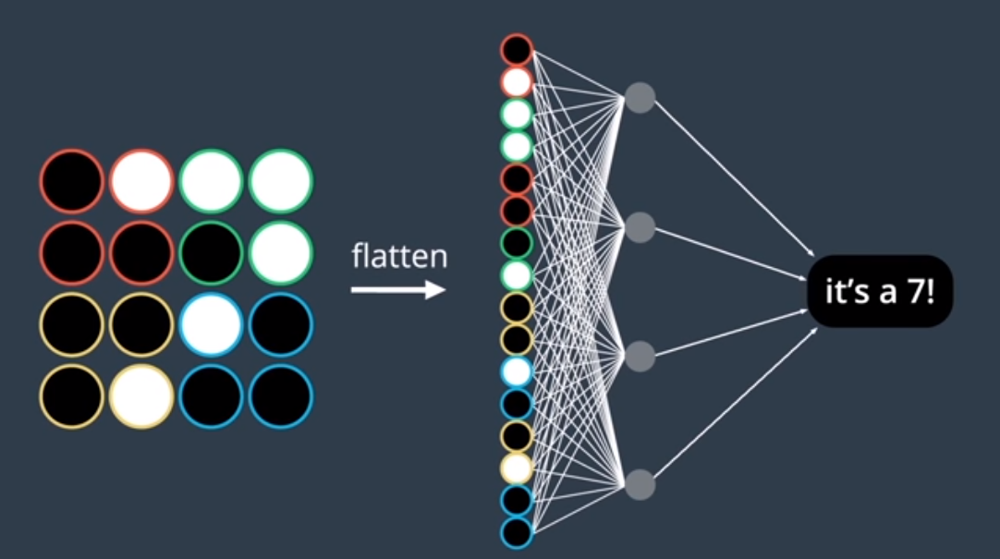

思考:让节点和每个输入像素都连接起来有必要吗?每个节点都需要了解图片的所有信息吗?

下面,我们进行一个大胆的尝试:保留图片中的二维信息.一个简单的做法是,把图片拆分成4个区域(就是上图中的红色,绿色,黄色,蓝色四个区域).每个节点仅仅处理一个区域的内容.

也就是说,每个隐藏节点都仅仅处理图片四分之一区域的规律.输出层集合这四个节点的输出,进行汇总后得到最终结果.

这样的网络类似下图这样:

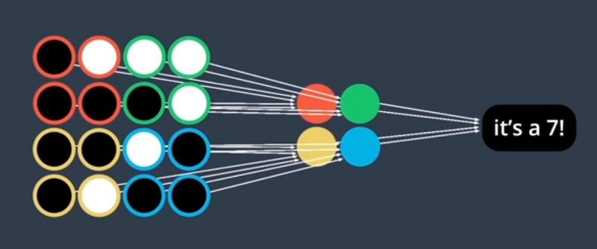

如果白色的像素点的权值能够训练得比较大,那么节点就能提取图片中的某些特征(当出现这种特征,就激活).例如,绿色的那个节点就能提取出"7"中右上角的曲线.

我们发现参数比传统的MLP模型少了很多.并且模型似乎能够更好地发现图像中的二维规律,更不容易过拟合.

这就是卷积层吗?很遗憾,这并不是卷积层,但是我们已经很接近了!

想象一个新的问题:特征只能出现在图片中的某个特定位置吗?上面的模型一个很严重的问题就是它只能提取特定位置的特征.例如绿色的节点只能提取右上角"7"的"曲线特征".但是如果这个特出现在了其它位置呢?

再比如,在制作一个识别小猫的模型的时候,我们不可能要求小猫只出现在图片的某个位置,它可能出现在图片的任何地方!

一个很好的解决方案是:让节点"动起来"!

对于二维图片来说,定义一个"卷积窗".卷积窗拥有width和height两个属性,描述了窗口的size.

另外,卷积窗的每个点都保存了一个参数.

随后,将卷积窗在图片上水平垂直地滑动,每次滑动,都对卷积窗包含的像素点使用卷积窗的参数进行一次计算(计算方法和感知器算法一样).这样,卷积窗滑动了多少次,就计算出了多少个结果.

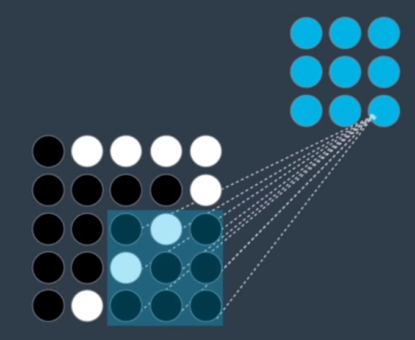

例如,对于一个5x5的黑白图像(上面的7).卷积窗的参数是:

p1|p2|p3
---|---|---
-1 | -1 | +1
-1|+1|-1
+1|-1|-1

这是一个3x3的卷积窗,在卷积窗的初始位置(左上角),假设白色是1,黑色是0.则计算规则和感知器算法一样:

$$(-1)\times 0 + (-1) \times 1 + (-1)\times 1 + $$

$$(-1)\times 0 + (+1) \times 0 + (-1)\times 0 +$$

$$(+1)\times 0 + (-1) \times 0 + (-1)\times 0 = 0$$

上面我们暂时假设Bias为0,激活函数是ReLU,ReLU对于0的输出还是0.按照同样的规则,滑动窗口(每次滑动一个单位),最终得到9个结果:

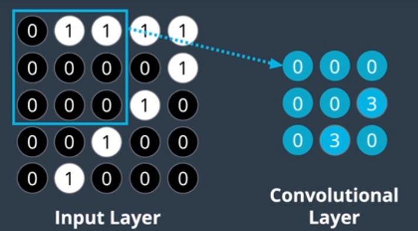

这就得到了卷积层的计算结果(注意ReLU会把所有负值结果转换为0,因此卷积层的结果中没有出现负数).我们也把卷积层的计算结果叫做**特征映射**.

现在,仔细观察卷积窗口的参数,发现它在左对角线的方向的参数都是+1.而在实际对图片作用之后,发现只有在左对角线是白线的情况下,才会产生3这个结果.

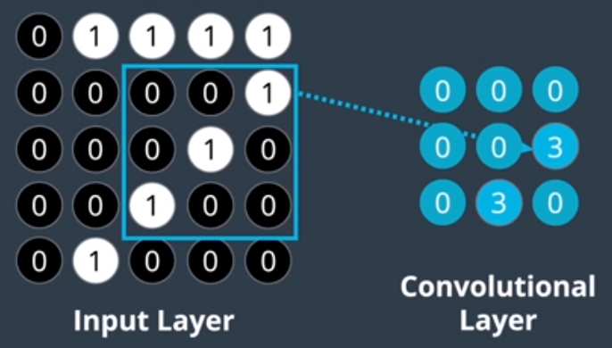

由此可见,一个卷积层可以提取图片中的某个特征,并且在结果中反应出这个特征在图片中的位置.

因此,可以把卷积窗口叫做过滤器(Filter),它能够过滤出图片(或者其它类型的多维数据)中的某些特征.我们把上面的过滤器中+1高亮,就可以得到下面这张图:

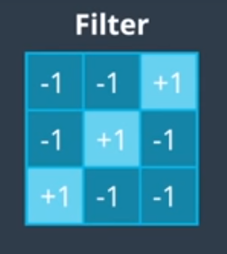

这和斜线的特征完全一致.可见,通过可视化过滤器,我们可以很方便地看到过滤器提取的特征是长什么样子的.

在训练的时候,这些权值并不是由我们人类设置的,而是由CNN自己习得的.

只要增加过滤器的数量,我们就可以识别图像中更多的特征,也就可以实现更加复杂的图像识别了.

在真实的训练中,仅仅识别一个特征(仅设置一个过滤器)是远远不够的.例如,对于识别小猫,我们可能需要过滤器去识别它的胡须,毛,猫耳朵,猫眼等等.

增加过滤器的方法很简单,只需要定义另外一组窗口参数即可.

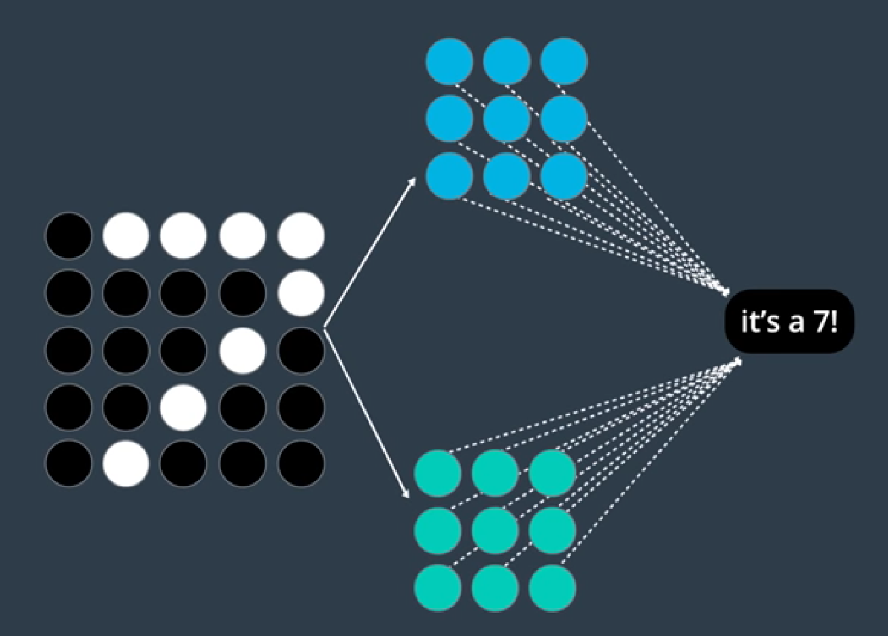

在实际训练中,一个卷积层可能存在非常多的过滤器.例如,使用简单的直线过滤器,我们能够过滤出图片中的某些边缘曲线:

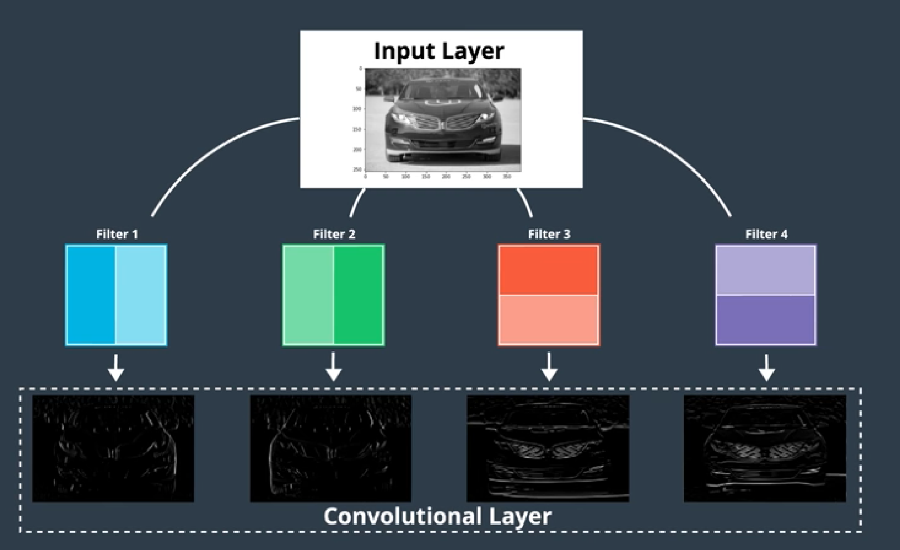

可视化之后,如果线的亮度越高,表示特征越明显.例如,第一个过滤器就能识别出汽车的右边缘.

我们上面的所有图片都是针对于灰白图片的,但是对于彩色图片呢?其实很简单,所有颜色都是由三原色的组合构成的.我们只需要把原来的二维数组改为拥有多色值的三维数组即可.对于RGB图片来说,这是一个深度为3的矩阵.

对于彩色图片的卷积层,处理起来和黑白的是类似的.只不过现在过滤器是三维的:

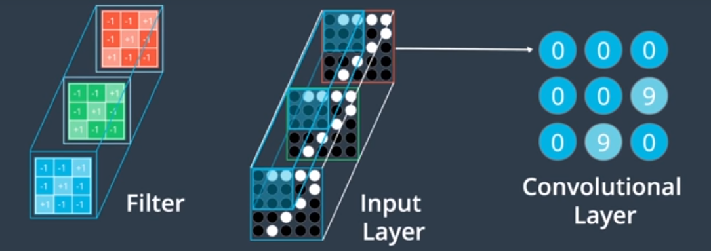

现在,每个过滤器的输出仍然是一个值,但是它是三个二维过滤器结果的和.

利用一个卷积层,能够发现图片中的某些特征,过滤掉其它一些没有用的东西(我们通过上面汽车的可视化已经可以看出来了).而卷积层又可以接受多维的数据.

我们现在单看某个卷积层的输出,如果有多个过滤器,发现它实际上也是多组的特征映射.那么,可以把这多组映射传给另外一个卷积层,继续过滤上一个卷积层已经过滤出来的特征(也就是提取特征中的特征).通过这样多层卷积层连接在一起,就产生了深层CNN,能够过滤出来一些非常复杂的特征.

卷积层的参数虽然比密集层要少不少,但是训练的过程也是一样的.一开始,参数是随机初始化的,通过最小化损失函数,来训练这些参数.这样,CNN就能逐渐训练出应该过滤哪些特征.

### Stride

我们可以通过指定卷积层的深度,过滤器的个数来控制CNN的能力.另外一个比较重要的参数是卷积的stride.

stride指的是过滤器在图片上每次滑动时移动的距离(用像素数量表示).在之前的例子中,stride均是1,即窗口每次移动一个像素点.

stride为1,则输出和输入图片的尺寸差不多.stride越大,输出就越小.

现在考虑一个情况,如果stride不为1,经常会发生过滤器"越界"的行为,如下图所示:

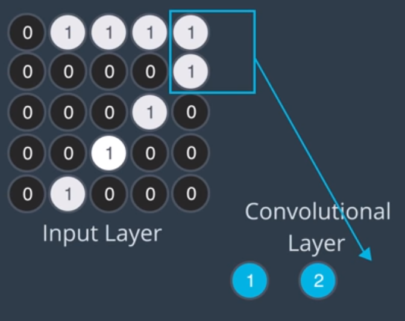

做法有两种:

- 直接删掉这些溢出的值.这样卷积层可能会丢失图片中某些区域的信息.
- 在图片边缘填充0,扩充图片使过滤器刚好能获取图片的所有信息.

填充图片的示意图如下:

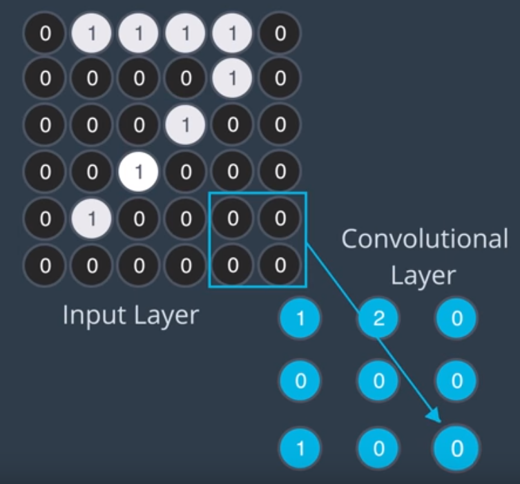

如果我们能够接收丢失一些图片信息,则可以选择第一种做法;否则,采用第二种做法.

通过padding参数可以指定遇到溢出时的处理方式,'valid'表示第一种做法;'same'表示第二种做法.

### 池化层

在构建CNN时,还需要另外一种层级,叫做池化层.

我们知道,卷积层有多少过滤器,它就能产生多少个深度的特征映射.如果过滤器很多,意味着输出的维度可能会非常巨大,并且可能会导致过拟合.

池化层就是用来降低卷积层输出的维度的.

我们有两种池化层,**最大池化层**.最大池化层也有窗口的size和strides参数,它对特征映射做类似卷积层的窗口滑动操作,不过每次计算不再使用感知器算法,而是简单地选择特征最大值.类似下面这样:

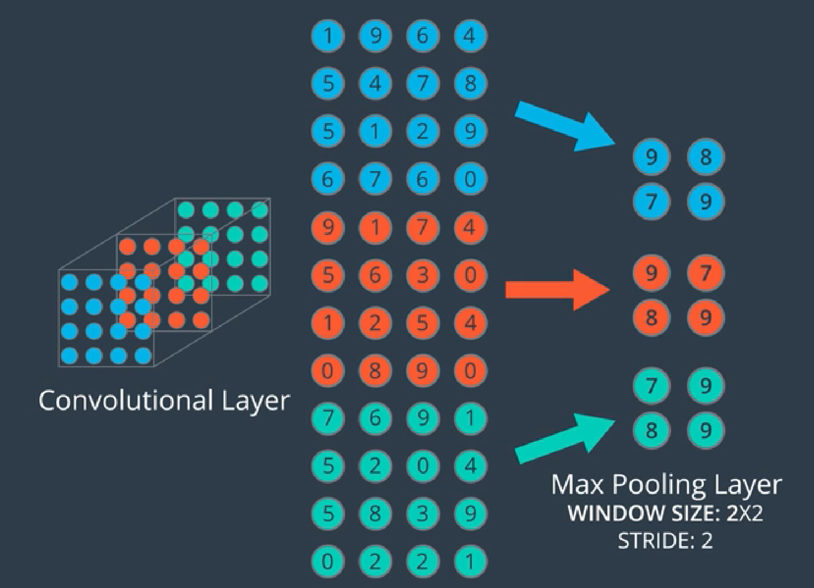

这样,就可以大大减少特征映射的尺寸:


另外一个池化层叫做**全局平均池化层**,这种池化层不需要指定窗口和stride.它降低维度的方式非常极端:它获取每一层特征映射,计算特征映射中所有值的均值.这样,有多少层特征映射,就产生了多少个结果.

最终输出就是多个一维的特征映射(实际上就是一个一维数组或向量):

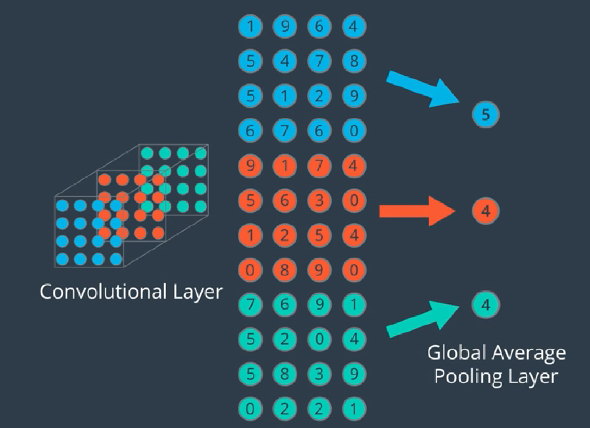

除了上面两种池化层,还有一些池化层可以选择,限于篇幅这里不再介绍.

### Keras实现CNN

#### Keras 卷积层

在Keras中创建卷积层是非常简单的.Keras中的卷积层是有维度的.对于我们的图像识别来说,是二维的,所以使用Conv2D.如果数据是一维的,则使用Conv1D.

创建Conv2D的方式如下:

```python
from keras.layers import Conv2D
Conv2D(filters, kernel_size, strides, padding, activation, input_shape)
```

对每个参数做一个解释:

- 必填参数
  - filters: 过滤器数量
  - kernel_size: 卷积窗口的尺寸.如果卷积窗口是正方形,则只需要指定一个数据,如果是长方形,则需要传一个元组
- 选填参数
  - strides: 卷积Stride.默认为1
  - padding: 'valid'或'same'.默认为'valid'
  - activation: 激活函数,通常为'relu'.默认不使用激活函数
  - input_shape: 如果卷积层出现在模型的第一层,需要指定,指的是输入数据的(height, weight, deep)元组.如果是Conv1D,不需要deep.

例如,假设现在要指定一个输入是200x200的灰度图片,第一层是卷积层,则第一层可以这么定义:

```python
from keras.models import Sequential
from keras.layers import Conv2D

model = Sequential()
model.add(Conv2D(filters=16, kernel_size=2, strides=2, activation='relu', input_shape=(200, 200, 1)))

model.summary()
```

使用model.summary()可以查看模型的概述,包括参数个数等信息.上面的这个模型输出是:


这个卷积层有80个参数.Output Shape表示该卷积层输出的大小.其中,None表示批次大小;卷积的高度为100,宽度为100,深度为16.

我们来看看这些参数怎么计算,先定义几个符号,$k$表示卷积层过滤器的数量,$f$表示过滤器的边长(假定过滤器都是正方形),$d_{in}$表示上一层的深度.

则参数的计算公式为:

- 权值个数: $k\times f^2\times d_{in}$
- 卷积层深度: $k$

卷积的尺寸计算稍微复杂一些.我们假设上一层(对于第一个卷积层来说,就是图片)的高度为$h_{in}$,宽度为$w_{in}$,Stride为$s$.

则如果pading为'same',卷积的维度为:

- height = ceil(float($h_{in}$)/float($s$))
- height = ceil(float($w_{in}$)/float($s$))

如果padding为'valid',卷积的维度为:

- height = ceil(float($h_{in} - f + 1$)/float($s$))
- height = ceil(float($w_{in} - f + 1$)/float($s$))

ceil返回大于或者等于指定表达式的最小整数.

#### Keras 最大池化层

Keras中最大池化层的API如下:

```python
from keras.layers import MaxPooling2D

MaxPooling2D(pool_size, strides, padding)
```

对参数做一个简要说明:

- 必要的参数
  - pool_size: 池化窗口的尺寸
- 可选的参数
  - strides: 默认为pool_size
  - padding: 'valid'和'same',默认为'valid'

假设我们要创建一个最大池化层,卷积层的输出大小为(100, 100, 15),我们希望池化后的大小为(50, 50, 15).则窗口边长应该为2.

下面的代码验证了这一点:

```python
from keras.models import Sequential
from keras.layers import MaxPooling2D

model = Sequential()
model.add(MaxPooling2D(pool_size=2, strides=2, input_shape=(100, 100, 15)))
model.summary()
```

输出为:


#### CNN架构

利用上面这些东西,我们就可以利用Keras构建一个完整的CNN了.

我们已经学习了卷积层和最大池化层.下面我们需要讨论如何排列这些层级,并设计出一个完整的CNN架构.我们将设计出一个图片分类CNN.

我们的首个问题是,图片的大小是不相同的.但是CNN需要固定的大小输入.我们需要选择一个大小,把所有图片处理成这个大小,才能执行其它操作.我们经常把图片调整为正方形的.

对于RGB图像,计算机会解释为三层二维数组.例如100x100的RGB图像的尺寸为(100, 100, 3),如果是黑白图片,则为(100, 100, 1).

在一开始,一张图像的宽和高是远大于它的深度的.我们的目标就是在CNN处理后让图像的深度远大于它的宽和高(提取更多的特征).

在架构中,卷积层用于提高图像的深度,最大池化层用于减少空间维度.形象点说,卷积层用于把图像"拉长",最大池化层用于把图像"挤扁".


在图像分类中,对于卷积层参数的选择,可以参考以下原则:

- filters: 决定了输出的深度,一般采取递增原则.例如第一层有16个,第二层有32个,第三层有64个等.
- kernel_size: 一般选为2,即窗口尺寸为2x2
- strides: 一般为1, 默认即可
- padding: 一般选'same',防止丢失一些信息
- activation: relu

除了卷积层,我们还需要池化层来减小高度和宽度,池化层一般紧跟在卷积层后面,最常见的参数选择是:

- pool_size: 一般选2
- stride: 一般选2
- padding: 默认即可

这样,每次池化层都会把卷积层的输出的高度和宽度减少一倍.

如果我们使用3个卷积层,就可以产生下面的架构(假设图片尺寸是32x32):

```python
from keras.models import Sequential
from keras.layers import Conv2D, MaxPool2D

model = Sequential()

model.add(Conv2D(filters=16, kernel_size=2, padding='same', activation='relu',
                 input_shape=(32, 32, 3)))
model.add(MaxPool2D(pool_size=2))
model.add(Conv2D(filters=32, kernel_size=2, padding='same', activation='relu'))
model.add(MaxPool2D(pool_size=2))
model.add(Conv2D(filters=64, kernel_size=2, padding='same', activation='relu'))
model.add(MaxPool2D(pool_size=2))

model.summary()
```

结果为:

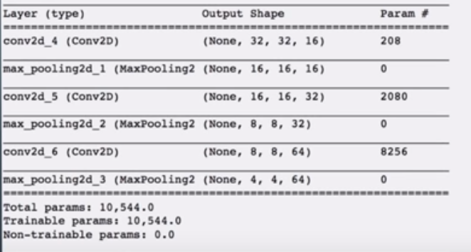

可见Shape符合我们之前的目标.

最后一层的输出Shape是(4,4,64).也就是说可以检测出4x4x64个特征.例如,在小猫识别中,最后一层可能可以告诉我们: 图片中有猫耳朵吗?图片中有猫胡须吗?图片中有猫爪吗?等等

一旦我们只需要这些yes or no的信息了,完全可以转换为一个一维的向量.利用Flatten层可以实现这一转换.最后,把这个一维的向量交给Dense层,让它来整合这些信息,产生最后的输出.例如,既有猫耳朵又有猫胡须但是没有猫爪的图片有95%的概率有猫,只有猫爪但是其他都没有的图片有30%的概率有猫,这些需要Dense层来完成.

最后还需要一个Dense层产生最终的输出.

这样,我们就构建了一个完整的图像识别CNN架构,代码如下:

```python
from keras.models import Sequential
from keras.layers import Conv2D, MaxPool2D, Flatten, Dense

model = Sequential()

model.add(Conv2D(filters=16, kernel_size=2, padding='same', activation='relu',
                 input_shape=(32, 32, 3)))
model.add(MaxPool2D(pool_size=2))
model.add(Conv2D(filters=32, kernel_size=2, padding='same', activation='relu'))
model.add(MaxPool2D(pool_size=2))
model.add(Conv2D(filters=64, kernel_size=2, padding='same', activation='relu'))
model.add(MaxPool2D(pool_size=2))
model.add(Flatten())
model.add(Dense(500, activation='relu'))
model.add(Dense(10, activation='softmax'))

model.summary()
```

注意,在MaxPool和Dense之间一定要跟上一个Flatten层,因为Dense只接受一维向量.最后一个Dense作为输出层使用,如果是多分类任务,使用softmax激活函数,单分类任务可以使用Sigmoid.在这个例子中,有10个待分类的类别.

这个网络的summary信息:

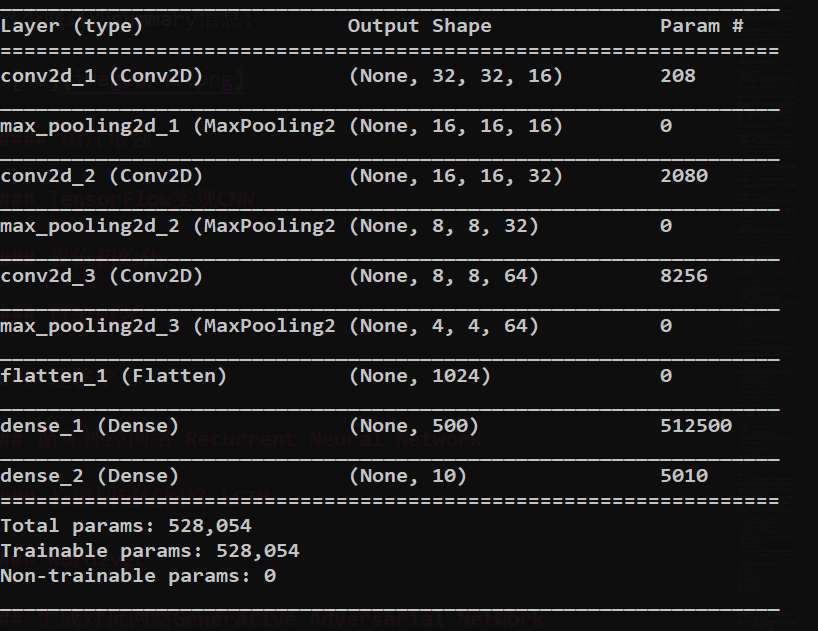

在实际中,以上的架构仅作为一个参考.深度学习更多的还是在于实践,上面的参数并不是一成不变的,还需要大量的调参才可能得到更好的效果.实际上,CNN的架构选择和调参确实有一定"玄学"的味道(不要怕,后面会介绍强大的迁移学习).

训练CNN的代码很简单,需要先编译后训练.编译的时候需要传入注入损失函数,优化器等选择(和Tensorflow一样),代码很简单,这里就不贴了.可以直接阅读下面的代码查看写法.

这里有一个利用上面的架构对CIFAR-10数据集进行训练的例子可以参考:[使用Keras CNN训练CIFAR-10数据集](https://github.com/LovelyLazyCat/ai/blob/master/deeplearning/cnn/cifar10.py)

这里需要训练4万多个数据,建议使用GPU进行训练(我使用NVIDIA GTX 960M训练大约耗时2分钟).

上面这个模型对CIFAR-10的训练准确度可以达到65%左右,后面我们学习迁移学习之后,可以训练出更加准确的模型.

CIFAR-10比赛的CNN获胜架构可以达到95%的准确度,这是这个架构的链接:[CIFAR-10获胜架构](http://blog.kaggle.com/2015/01/02/cifar-10-competition-winners-interviews-with-dr-ben-graham-phil-culliton-zygmunt-zajac/).

#### 图片增强

在某些训练中,我们只需要检测出图片中是否含有某个对象,其位置,大小,方位并不重要.

这是我们希望模型能够学习到图片的不变表示.不变性有下面几种分类:

- 标度不变性: 不希望模型根据对象的大小而改变预测
- 旋转不变性: 不希望模型根据对象的角度而改变预测
- 平移不变性: 不希望模型根据对象的位置而改变预测

我们的解决方法是,如果要CNN有旋转不变性,可以在训练集中增加数据,这些数据是对训练图片的随机旋转.我们也可以改变训练集的大小等.

这就是数据增强.它可以减少模型的过拟合.

Keras自带了图片增强的功能,我们需要导入并且传入一些参数:

```python
from keras.preprocessing.image import ImageDataGenerator

datagen = ImageDataGenerator(
            width_shift=0.1,
            height_shift_range=0.1,
            horizontal_flip=True)

datagen.fit(x_train)
```

上面的这个增强器会随机地水平和垂直移动,翻转图片.

使用图片增强之后,训练的代码就略有不同了,现在训练代码应该这么写:

```python
batch_size = 32
model.fit_generator(datagen.flow(x_train, y_train, batch_size=batch_size),
                    steps_per_epoch=x_train.shape[0] // batch_size, ...)
```

其余的写法和之前相同.注意我们不再调用fit方法而是调用fit_generator.datagen.flow()方法使增强器能够创建一批一批增强图片,需要传入每次生成增强图片的个数.

另外还要指定一个额外的参数steps_per_epoch,表示每个epoch的步长数量.通常设定为数据集中唯一样本的数量除以批次大小.

### TensorFlow实现CNN

下面我们看看如何在Tensorflow中实现CNN.

### 迁移学习

## 循环神经网络 Recurrent Neural Network

### 长短期记忆网络 LSTM

### Word2vec

## 生成对抗网络Generative Adversarial Network

### 深度卷积生成对抗网络

### 半监督GAN模型
