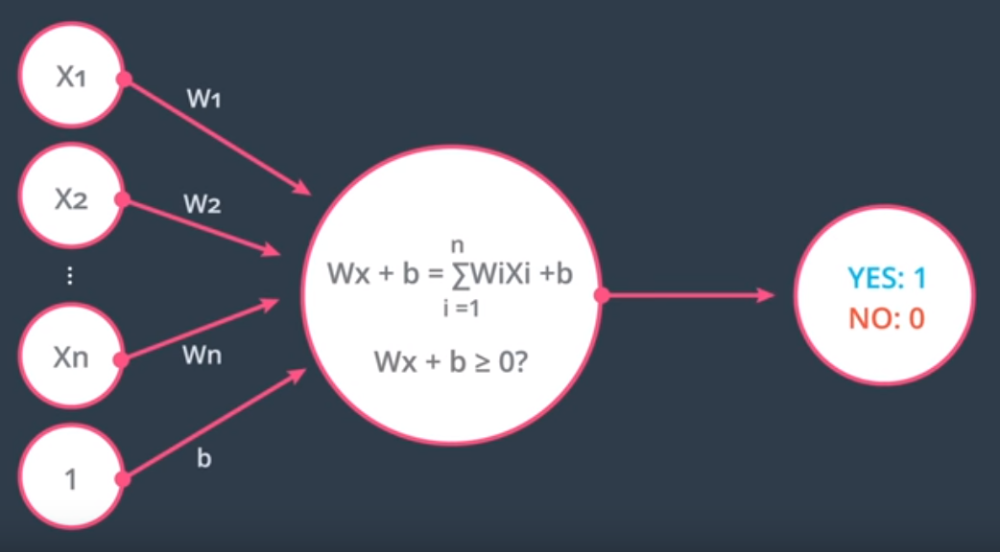
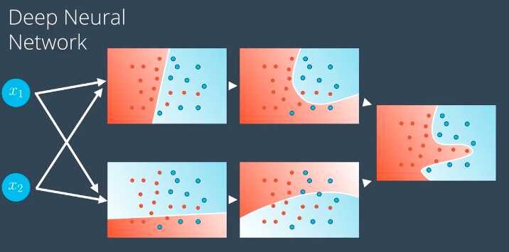
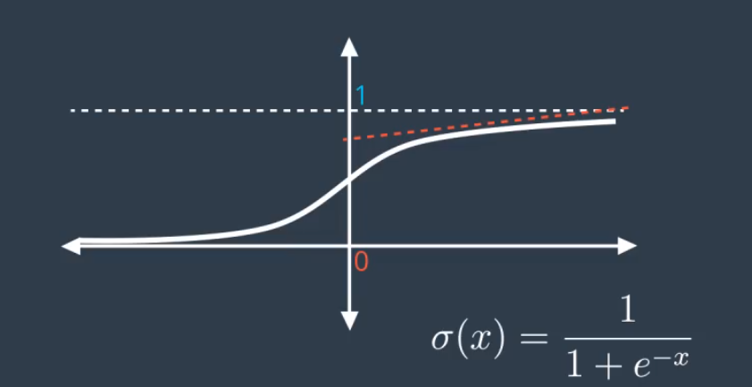
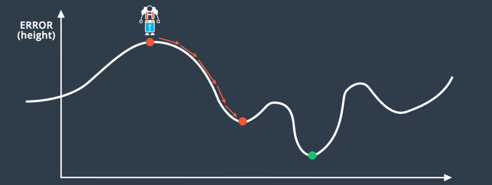
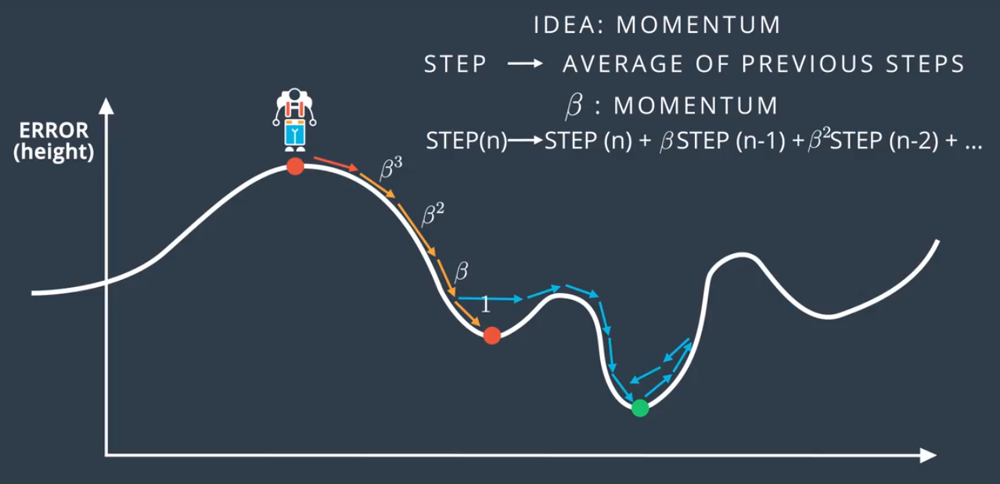
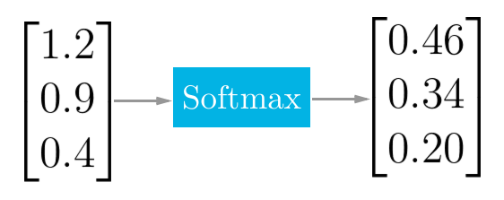

# 深度学习

**注意:请使用Chrome阅读并安装[Github with MathJax](https://chrome.google.com/webstore/detail/github-with-mathjax/ioemnmodlmafdkllaclgeombjnmnbima/related)插件,否则文中的数学公式无法显示,除非你愿意读原始Latex代码_(:з」∠)_**

欢迎来到深度学习的神奇世界!

**目录**:

<!-- TOC -->

- [深度学习](#深度学习)
    - [感知器](#感知器)
    - [Sigmoid激活函数](#sigmoid激活函数)
    - [Softmax激活函数](#softmax激活函数)
    - [交叉熵 Cross Entropy](#交叉熵-cross-entropy)
    - [梯度下降法 Gradient Descent](#梯度下降法-gradient-descent)
    - [神经网络 Neural Network](#神经网络-neural-network)
        - [前向反馈 Feed Forward](#前向反馈-feed-forward)
        - [反向传播 Back Propagation](#反向传播-back-propagation)
    - [过拟合](#过拟合)
        - [早期停止](#早期停止)
        - [正则化](#正则化)
        - [Dropout](#dropout)
    - [ReLU激活函数](#relu激活函数)
    - [随机梯度下降](#随机梯度下降)
    - [学习速率](#学习速率)
    - [动量](#动量)
    - [TensorFlow 入门](#tensorflow-入门)
        - [Tensor](#tensor)
        - [Session](#session)
        - [输入](#输入)
        - [线性模型(单感知器)](#线性模型单感知器)
        - [Softmax](#softmax)
        - [交叉熵](#交叉熵)
        - [Mini Batch](#mini-batch)
        - [实现两层网络](#实现两层网络)
        - [训练两层网络](#训练两层网络)
        - [保存和读取模型](#保存和读取模型)
        - [Dropout](#dropout-1)
    - [卷积神经网络 Convolutional Neural Network](#卷积神经网络-convolutional-neural-network)
        - [Keras实现CNN](#keras实现cnn)
        - [TensorFlow实现CNN](#tensorflow实现cnn)
        - [权值初始化](#权值初始化)
        - [自编码器](#自编码器)
        - [迁移学习](#迁移学习)
    - [循环神经网络 Recurrent Neural Network](#循环神经网络-recurrent-neural-network)
        - [长短期记忆网络 LSTM](#长短期记忆网络-lstm)
        - [Word2vec](#word2vec)
    - [生成对抗网络Generative Adversarial Network](#生成对抗网络generative-adversarial-network)
        - [深度卷积生成对抗网络](#深度卷积生成对抗网络)
        - [半监督GAN模型](#半监督gan模型)

<!-- /TOC -->

## 感知器

神经网络最基础的概念就是感知器.一个感知器实际上就是一个节点,它可以接受n个输入X,每个输入都有一个权重W.感知器将输入和权重相乘后加起来,得到一个结果.我们一般把这个结果叫做"得分".

对于这个结果,我们需要一个特殊的函数作用于它,然后产生的就是最终输出.这个函数叫做**激活函数**.激活函数用于把WX产生的结果转换为人们更加容易理解的输出结果.相当于把"得分"转换为"最终结果".一种激活函数是"阶跃函数",当x&gt;0,阶跃函数输出1;当x&lt;0,阶跃函数输出0.



注意一个特殊的输入和权值1和b.它们实际上构成了bias.bias能够控制感知器在什么时候能够"激活"(指的是感知器返回1).它实际上刻画了感知器的"敏感程度".bias也可以不写成权值和输入的形式,而作为感知器的一个属性保存在感知器内部.当bias越大,感知器越难被激活.

由此可见,感知器可以解决简单的"二分类"问题.那么现在的问题就是我们如何调整W使得感知器能够进行准确的分类.

在一开始,W是随机设置的,使用这样的感知器去对数据分类,必然会产生很大的误差,我们的目的就是尽可能最小化这个误差.那么在感知器算法中,如何定义这个误差并且最小化它就成为了很关键的一步.

在二分类问题中,误差可以简单地看作分类错误的点的数量.但是这个误差函数并不是连续的,我们就无法很好地使用梯度下降法(gradient decent)去最小化误差了(因为误差函数是不可微的).

**NOTES: 误差函数必须是连续可微的!**

## Sigmoid激活函数

为了使误差是连续可微的,我们就不能再使用阶跃函数这种只会产生0和1这种离散值的激活函数了.必须使用一个连续的激活函数.

这里引入Sigmoid函数,Sigmoid将很大的值输出为接近1的值,将很小的值输出为接近0的值.越接近0的值,Sigmoid将会给出越接近0.5的结果.


记:

$$\sigma(x)=\frac{1}{1+e^{-x}}$$

在二分类问题中,使用Sigmoid函数给出的结果并不是精确的分类,而是对分类的一个预测.如果结果越接近1,就表示感知器有更大的把握把该数据分为1类;越接近0,则有更大的把握分为0类别.

这样我们的误差函数就可以定义为: $E=(\hat{y}-y)^2$.其中$\hat{y}$表示感知器的输出,$y$表示正确的分类.因为使用sigmoid激活函数,所以$\hat{y}$是连续的,这样一来$E$也是连续的了.

## Softmax激活函数

在二分类问题中,使用sigmoid激活函数可以给出数据属于某一类别的概率.但是对于多分类问题,sigmoid函数产生的一个[0,1]的结果必然是不够的.

我们希望有这样一个激活函数: 它能告诉我们数据属于不同类别的概率分别是多少.这样我们就可以使用概率最高的那个类别作为预测结果了.

Softmax函数就是这种思想,它接收数据在不同类别的"评分"(这个评分实际上是由感知器算得的值),根据不同类别评分来计算出数据属于不同类别的概率,随后选择概率最大的那个类别作为输出结果.

一个softmax函数的python代码如下:

```python
import numpy as np
def softmax(L):
    # 对所有结果取exp以将负数转换为正数
    expL = np.exp(L)
    sumExpL = sum(expL)
    result = []
    for i in expL:
        result.append(i * 1.0 / sumExpL)
    return result
```

## 交叉熵 Cross Entropy

使用Sigmoid或Softmax激活函数可以求出一个数据属于各种类别的概率.我们同时知道该数据的正确类别,那么就知道了数据属于正确类别的概率.

根据最大似然法,我们希望最大化分类正确的概率.所以完全可以使用分类正确的概率作为误差函数.当然在我们的认知中,误差应该是要去最小化的,所以可以对分类正确的概率取-ln.这就得到了交叉熵.交叉熵越大,就表示正确分类的概率越小.

下面给出交叉熵的完整定义,对于一个二分类问题,假设$y$是数据的正确类别,它只能取0或1.$\hat{y}$是感知器给出的预测,它越接近1就表示数据属于正例的概率越高,m表示数据点的个数.那么交叉熵的计算公式为:

$$CE=-\sum^m_{i=1}y_iln(\hat{y}_i)+(1-y_i)ln(1-\hat{y}_i)$$

对于多分类问题,我们定义$\hat{y}_{ij}$为感知器输出的第$j$个数据属于类别$i$的概率.

$y_{ij}$等于1如果第$j$个数据属于$i$类,否则等于0,m表示有几个类别,n表示数据点的个数.那么多分类的交叉熵公式为:

$$CE=-\sum^m_{i=1}\sum^n_{j=1}y_{ij}ln(\hat{y}_{ij})$$

我们可以使用交叉熵作为神经网络的误差函数使训练更加符合概率论的理论.

## 梯度下降法 Gradient Descent

有了上面的交叉熵作为误差函数,我们就可以使用梯度下降法来最小化误差了.

注意我们现在面对的问题仍然是训练感知器使其能够正确地执行分类问题.也就是我们需要调整参数W和bias.

这里介绍梯度下降法,它的思想非常简单.我们现在的目标是最小化误差,使用随机的参数分类数据得到一个误差后,我们可以计算这个点在误差函数上的梯度,随后向梯度的方向调整参数(实际上就是用参数减去算得的梯度),就可以实现对误差的减少.

以上的步骤多执行几次,我们可以让误差点逼近于误差函数的最小值或局部最小值,这样,就得到了一个较为完善的模型.

下面推导感知器学习中梯度下降法的完整数学过程:

首先,Sigmoid函数有一个非常好的求导特征:

$$\sigma\prime(x)=\sigma(x)(1-\sigma(x))$$

假设问题是一个二分类问题,如果有m个样本点(训练集),误差公式为:

$$E=-\frac{1}{m}\sum^m_{i=1}y^iln(\hat{y}^i)+(1-y^i)ln(1-\hat{y}^i)$$

$\hat{y}^i$表示预测值,在感知器算法中,它的计算公式如下:

$$\hat{y}^i=\sigma(Wx^i+b)$$

我们需要计算每一个$w^i$关于误差$E$的梯度,从而对参数进行调整.这里需要求:


有了上面的式子,我们可以对误差$E$求导:


类似可以计算出bias的梯度:

$$\frac{\partial}{\partial{b}}E=\frac{1}{m}\sum^m_{i=1}(y_i-\hat{y}_i)$$

通过上面的推导,我们可以知道:对于一个点$(x_1,x_2,\dots,x_n)$,标签为$y$,感知器预测为$\hat{y}$.那么该点的误差函数梯度为:

$$-(y-\hat{y})(x_1,x_2,\dots,x_n,1)$$

现在,我们能够写出梯度下降的代码了:

```python
# Implement of Gradient Desent for Sensor Algorithm.

import numpy as np
# Activation function
def sigmoid(x):
    return 1 / (1 + np.exp(-x))

# final output
def output_formula(features, weights, bias):
    return sigmoid(np.dot(features, weights) + bias)

# Use final output to calculate error.
def error_formula(y, output):
    return - y * np.log(output) - (1 - y) * np.log(1 - output)

# Use Gradient Desent to update weights.
def update_weights(x, y, weights, bias, alpha):
    output = output_formula(x, weights, bias)
    error = -(y - output)
    weights -= alpha * error * x
    bias -= alpha * error
    return weights, bias
```

上面是核心的辅助函数,可以帮助感知器完成训练.其中alpha表示学习率,范围在[0,1]之间,alpha越大,学习速度越快.适当减少alpha可以在一定程度上避免过拟合.

在真正训练的时候,需要不断地对weights和bias调用update_weights更新.具体次数通过epochs控制.

另外要注意的是,我们在训练的时候得到的是多组梯度(每个点都可以产生一组梯度),一般情况下,我们可以去这些梯度的均值作为最终的梯度结果.

一份简单的训练代码如下:

```python
import numpy as np
# Train Sensor.
def train(features, targets, epochs, alpha):
    errors = []
    n_records, n_features = features.shape
    # Randomly initialize weights.
    weights = np.random.normal(scale=(1 / n_features**.5), size=n_features)
    bias = 0
    for i in range(epochs):

        for x, y in zip(features, targets):
            output = output_formula(x, weights, bias)
            error = error_formula(y, output)
            weights, bias = update_weights(x, y, weights, bias, alpha)

```

## 神经网络 Neural Network

感知器模型能够很好地解决线性分类问题,但是真实世界的环境往往比线性分类要复杂得多.要解决更加复杂的,非线性的问题,就要引入我们深度学习的主角了: 神经网络.

神经网络这个概念来源于生物学.大脑中的神经网络由几乎无数多个神经元构成.神经元之间通过突触连接在一起.当一个神经元"兴奋"时,它可以把这种"兴奋"通过突触传递给其它神经元.

AI中的神经网络概念类似,但是它更加"数学化".AI中的神经元就是我们上面介绍的感知器,但是这个感知器的权值不再是简单地接受输入了,而可以连接着其它更多的感知器.当一个感知器被"激活"(通过激活函数,权重,输入,bias计算结果)时,它能把结果传给其它更多的感知器.

这样一来,通过多层感知器构成的人工神经网络(这种叫法是为了区别生物中的神经网络,但是因为本文不涉及生物,所以下面都简称神经网络),就能够解决非常复杂的非线性问题了.

一个神经网络的具体结构如下:


这是一种层级的结构.注意,并不是所有神经网络都采用这种结构,现在有更多先进的结构如CNN,RNN(后面会介绍),但这是最简单的,最容易入门的结构.

每层由多个感知器构成,层内部的感知器是不相连的,但是层之间的感知器是"密集连接"的.

这种结构有3种层:

- 输入层(Input Layer): 用于接受输入数据,然后传递给Hidden Layer.输入层一般不进行运算.
- 隐藏层(Hidden Layer): 最主要的"功能层".接收来自输入层的数据并进行计算,然后将结果传给输出层进行输出.隐藏层可以有多层(隐藏层之间也是密集连接的).一般来说,隐藏层越多,神经网络就越强大.
- 输出层(Output Layer): 接收隐藏层的计算结果,整合之后进行输出.对于分类任务来说,使用Softmax激活函数,一般有多少目标类别,输出层就有多少个感知器,每个感知器输出的是数据属于这个类别的概率.

为什么这样整合就能产生复杂的模型呢?实际上每个感知器仍然在做简单的线性分类,它们只能提取数据的一些简单的特征.但是通过多个隐藏层已经输出层的整合,最终就能产生非线性模型,下面的图可以有助于理解:



现实中的一些复杂的问题如图像识别,无人车驾驶等,就可以通过增加大量的隐藏层来实现训练.当隐藏层足够多,模型足够复杂,我们就称这种训练为**深度学习**了.

现在,我们已经了解了什么叫做神经网络,下面研究怎么去训练它.

训练神经网络和训练感知器的思路是一样的,我们需要训练所有的权值W和偏差Bias.只不过,神经网络的参数比感知器要多得多.但是我们仍然可以用训练数据去计算误差函数的梯度,然后使用梯度来反过来调整参数.

### 前向反馈 Feed Forward

为了训练神经网络,我们首先需要了解它怎么将一个输入数据转换为输出.

对于下面的一个神经网络(Bias作为感知器):


我们使用矩阵来表示它的权重和输入:


现在,可以通过矩阵运算求得最终结果:

$$\hat{y}=\sigma(W^{(2)}\sigma(W^{(1)T} \cdot X))$$

因为$W^{(1)}$是一个3x2矩阵,X是3x1矩阵,无法直接相乘,所以$W^{(1)}$需要转置.

有了$\hat{y}$,我们就可以根据$y$来求得误差函数了.多层感知器的误差函数和之前的单个感知器的误差函数是一样的(具体公式参见之前"交叉熵"的部分).

### 反向传播 Back Propagation

反向传播是训练神经网络最重要的方法,英文为BackPropagation.用BP算法训练出来的神经网络被叫做BP神经网络.

BP算法的思想其实很好理解,其核心思想也是对误差进行梯度下降来调整参数,其步骤如下:

- 进行前向反馈(Feed Forward),算出$\hat{y}$
- 比较$\hat{y}$和$y$,计算误差
- 向后将误差分散到每个权重之上
- 运用误差更新每个权重
- 重复上述步骤,直到误差收敛

首先,我们整理之前学的但是要在BP算法中用到的公式:

单隐藏层神经网络的预测结果为:

$$\hat{y}=\sigma(W^{(2)}\sigma(W^{(1)T} \cdot X))$$

误差函数为:

$$E(W)=-\frac{1}{m}\sum^m_{i=1}y_iln(\hat{y}_i)+(1-y_i)ln(1-\hat{y}_i)$$

对于单个感知器,误差函数的梯度表示为:

$$\nabla E=(\frac{\partial E}{\partial w_1},\frac{\partial E}{\partial w_2},\dots,\frac{\partial E}{\partial w_n}, \frac{\partial E}{\partial b})$$

但是在神经网络中,w多了很多,下面是简化表示:

$$\nabla E=(\dots,\frac{\partial E}{\partial w_j^{(i)}}, \dots)$$

我们可以把误差梯度写成矩阵的形式:

$$\nabla E=(\frac{\partial E}{\partial W^{(1)}},\frac{\partial E}{\partial W^{(2)}},\dots,\frac{\partial E}{\partial W^{(n)}})$$

对于某个权重的更新,方法和训练感知器是一样的:

$$w^{(k)}=w^{(k)}-\alpha\frac{\partial E}{\partial w^{(k)}}$$

现在我们假设我们的神经网络是下面这样的:


我们可以直接书写出每个h的表达式:


我们需要计算$\frac{\partial E}{\partial W^{(k)}_{ij}}$.

单独计算对$W^{(1)}_{11}$的偏导数(使用链式求导法则):


这里的链式求导非常有意思,它实际上反映了一个"传播误差影响"的过程.

因为篇幅原因,具体的求导我这里不再演算了(直接通过上面给的表达式求导即可),详情可以看西瓜书.

对每个$W$求导,就可以求出所有参数的梯度,随后就可以执行梯度下降了.

## 过拟合

如果一个模型过于复杂,很容易出现过拟合的现象.对于神经网络这种复杂的模型,过拟合更加容易发生.下面介绍几种预防过拟合的方法.

### 早期停止

在训练神经网络的时候,Epoch是一个很重要的参数,Epoch越高,训练出来的模型越复杂.我们可以以Epoch为x轴,以误差为y轴,不断调整Epoch的值,绘制训练数据和验证数据的误差曲线.

在Epoch比较小的时候,模型偏向于随机猜测,因此训练集和验证集的误差应该比较接近,并且比较大.当Epoch不断增大,模型得到训练后,误差应该会不断减少.Epoch过大的时候,模型出现过拟合,这时候的特征是训练集的误差比较小,测试集的误差比较大,二者出现分离.

曲线的形状类似下面这样:


早期停止的目标在于找到一个适中的复杂的模型.这样的模型的训练集和验证集的准确度应该是相差不大的,但是整体的误差又较少.在上面的图中,只需要找到训练误差和验证误差刚开始分离的点.也就是Epoch为20的点.

### 正则化

我们同时希望训练出来的神经网络的权值不要太大,不然通过Sigmoid激活函数算出来的值可能会过于接近1或0.这也可能导致过拟合.更加严重的问题是,如果权值过大,将会导致输出函数过于陡峭,不利于进行梯度下降法调整参数.

我们可以对误差函数进行调整,以惩罚比较大的参数.

我们假定旧的误差参数为:

$$E=-\frac{1}{m}\sum^m_{i=1}y_iln(\hat{y}_i)+(1-y_i)ln(1-\hat{y}_i)$$

定义$\lambda$为惩罚系数(越大则对于越大的参数惩罚越大),则定义L1正则化为:

$$L_1=E+\lambda(|w_1|+\dots+|w_n|)$$

定义L2正则化为:

$$L_2=E+\lambda(w_1^2+\dots+w_n^2)$$

L1正则化得到的权值比较稀疏,较小的都趋向于0,较大的都趋向1,如果想要降低权重值,最终得到较少的结果,可以使用L1正则化.也就是说,在特征比较多的时候,我们希望神经网络给出一个比较确定的值,其余的都接近0,可以使用L1.

L2并不产生稀疏的权重,但是它保证权重都一致较小.也就是得出较小齐权向量.L2相比L1能够训练出表现更加好的模型.

### Dropout

有时候,训练出来的神经网络可能会出现"局部用力过猛"的现象.也就是说某些权重过大,而其余权值过小,过大的权值对训练结果起到了决定性作用,而较小的权值对训练结果几乎没有影响.

L2正则化可以在一定程度上解决这个问题,因为它能够得到一致小的权值.

另一种方案是Dropout,也就是在训练过程中,在某些Epoch中,把一些节点关闭,只训练局部的节点.这时候,其余的节点要承担起责任,在训练中起到更大的作用,得到更好的效果.

使用Dropout能够保证神经网络中所有的节点都得到充分的训练.

我们可以设置一个参数,这是一个概率,表示每个节点在每次Epoch中被放弃的概率.合理地设置这个值可以让训练出来的神经网络中的每个节点都起到一定的作用.

## ReLU激活函数

Sigmoid激活函数有一个问题,在某些点,其导数会非常小,例如:



而在梯度下降的链式求导中,我们会不断将这么小的导数相乘,最终得到的梯度就非常地小(几乎趋近于0).在这种情况下,梯度下降将会非常地慢,一次Epoch的训练效果极差.这个问题叫做**梯度消失**.

解决这个问题的一个手段是使用另外一个激活函数:ReLU(Rectified Linear Unit).


这个激活函数比Sigmoid更加通用,它能显著地改善训练效果,但是不会太牺牲准确性.因为如果数字是正数,导数为1.这样产生的梯度将会比Sigmoid大很多.

**NOTES:ReLU激活函数一般可以放在隐藏层中使用,而对于输出层,如果是二分类任务,则一般使用Sigmoid激活函数,如果是多分类任务,一般使用Softmax激活函数.**

## 随机梯度下降

在传统的梯度下降中,每个Epoch误差会减少误差的梯度,从而逼近梯度的局部最低点.然而,这意味对于每个权重都要进行大量的矩阵运算,会耗费大量的内存.如果神经网络比较复杂,权值很多,训练过程的计算量将会超乎想象.

随机梯度下降可以更快地计算出梯度值.它的思想非常简单,在每个Epoch中,我们只使用一部分数据进行前向反馈得到误差,并使用这个误差进行反向传递以更新权值.

我们可以把数据拆分为多个"批次".假如一个训练集有24个数据点,我们可以把它拆分为4批,每批6个点.每个Epoch使用其中的一批进行训练.

## 学习速率

如果学习速率很大,每次对权值的调整也会很大,模型可能会非常混乱,但是有更大的可能得到最优策略;如果学习速率很小,那么每次调整都会比较保守,最终收敛的概率更大,但是得到的可能并不是最优策略.

下面这张图显示了学习速率对于梯度下降的影响:


那么我们如何调整学习速率呢?一个好的准则是:如果最终模型不令人满意,可以尝试增大学习速率.

当然,我们也可以使用**随机重新开始**方法.这种方法从几个不同的随机点开始,分别进行梯度下降.这样可以增大得到全局最低点的概率.

## 动量

另外一个逼近误差全局最低点的方法是使用动量.动量可以帮助我们翻过一些局部最低点,从而找到误差的更低点.

在传统的梯度下降中,如果到达局部最低点,梯度已经下降到0了.我们就不可能翻越这个"山谷"了.情况类似下面这样:



我们希望在最低点能够继续前进一定程度的步长,从而能够翻过一些潜在的局部最低点.

一个解决方案是,在到达最低点后,让误差增大一个值,这个值和之前的步长有一定关系.离当前时间点越远的步长对这个值影响越小,越近的步长影响越大.

我们引入动量$\beta$,这是一个介于0和1之间的值,那么,在到达最低点之后,继续行走的步长为:

$$STEP=STEP(t)+\beta STEP(t-1)+\beta^2STEP(t-2)+\dots$$

这样,误差就可以翻越局部最低点了:



一个小问题是,在到达最低点之后,误差仍然会有一定的波动,但是这个波动不是很大,对最终结果并不会造成太大的影响.

在实际中,使用动量更有可能得到更加好的模型.

使用Python创建神经网络进行分类的传送门:

## TensorFlow 入门

在安装完TensorFlow之后,输入代码可以检测TensorFlow是否正常安装:

```python
import tensorflow as tf

hello_constant = tf.constant('Hello TensorFlow!')

with tf.Session() as sess:
    output = sess.run(hello_constant)
    print(output)

```

### Tensor

在TensorFlow中,数据不是以整数,浮点数或者字符串的形式储存的.这些值被封装在一个叫做tensor的对象中.在上面的hello程序中,hello_constant就是一个0维度的字符串tensor,tensor可以有很多不同的大小:

```python
# 0-dimensinal int32 tensor
a = tf.constant(1000)

# 1-dimensinal int32 tensor
b = tf.constant([1, 2, 3])

# 2-dimensinal int32 tensor
c = tf.constant([[1, 2, 3], [5, 6, 7]])

```

tf.constant()会返回一个常量tensor,这个tensor的值不能发生改变.

### Session

TensorFlow的api构建在computational graph的概念上,它是一种对数学运算过程进行可视化的方法.刚才的hello程序可以变为以下的图:


TensorFlow Session是用来运行图的环境.这个session负责分配GPU(s)或CPU(s),包括远程计算机的运算,使用的基本方法是:

```python
with tf.Session() as sess:
    output = sess.run(tensor)
```

tensor是之前已经创建好的Tensor对象.使用sess.run()函数可以对tensor进行求值,并返回结果.

Tensorflow编程的核心思想是,先构建运算graph,也就是Tensor之间的运算关系.这时候,Tensor并没有真正地求值,只有在tf.run()之后,Tensorflow才会执行这个graph,真正地对Tensor进行求值.这样的编程模式有点类似于Spark的RDD编程.

### 输入

tf.placeholder()可以产生一个常量的Tensor,但是可以在Session启动之后再赋值.可以通过sess.run()中的feed_dict参数设置.

注意一点,tf.placeholder()产生的Tensor是在Session创建之后再赋值的.初始化的时候仅需要指定它的类型.

```python
import tensorflow as tf

x = tf.placeholder(tf.string)

with tf.Session() as sess:
    output = sess.run(x, feed_dict={x: "Hello Tensorflow!"})
    print(output)
```

我们也可以在feed_dict中设置多个Tensor:

```python
import tensorflow as tf

x = tf.placeholder(tf.string)
y = tf.placeholder(tf.int32)
z = tf.placeholder(tf.float32)

with tf.Session() as sess:
    output = sess.run(x, feed_dict={x: 'Test string', y: 12, z: 1.2})
    print(output)

```

注意如果Tensor的类型和传入的值类型不一样,TensorFlow会报错.

### 线性模型(单感知器)

神经网络中最常见的计算,就是计算输入,权重和偏差的线性组合.我们通常把线性运算的输出写为:

$$y=Wx+b$$

训练神经网络的目的是更新权重和偏差来更好地预测目标.为了更新,需要一个能修改的Tensor.这就需要tf.Variable了.

tf.Variable可以创建一个可变值的Tensor,就像Python的普通变量一样.该tensor把状态存在session里面,所以必须手动初始化它的状态.我们可以使用tf.global_variables_initializer()函数来初始化所以可变tensor.

以下的代码创建Variable并且初始化:

```python
x = tf.Variable(5)

with tf.Session() as sess:
    sess.run(tf.global_variable_initializer())
```

tf.global_variables_initializer()会返回一个操作,它会从graph中初始化所有的Tensorflow变量.可以通过session来调用这个操作初始化所有上面的变量.

线性回归需要用到权重,我们一般从正态分布中取随机数来初始化权重.tf.truncated_normal()返回一个tensor,它的随机值取自一个正态分布.

bias一般初始化为0,使用tf.zeros()可以返回一个初值全部是0的Tensor.

在使用Tensorflow构建一个线性模型并训练的过程中,我们需要定义下列Tensor:

- 训练数据和测试数据
- 参数,这里指的是weights和bias
- 模型的计算过程,可以使用Tensorflow计算公式完成,输出叫做logit
- 损失,定义在训练的时候使用什么标准作为模型误差的衡量工具.一般使用交叉熵(后面会介绍)
- 优化器,定义在训练过程中怎么减少损失优化模型.一般使用梯度下降优化器(Tensorflow有提供,需要传入学习速率和要最小化的损失).

一个使用Tensorflow进行线性回归并且对著名的MNIST数据集中0,1,2进行分类的例子:[Tensorflow实现线性回归](https://github.com/LovelyLazyCat/ai/blob/master/deeplearning/tensorflow_test/linear_regression.py).

### Softmax

Softmax可以把它的输入,通常称为logits或者logit scores,处理成0到1之间的数字,并且能够把输出的和归一化为1.这意味softmax函数与分类的概率分布等价.在多分类任务中,它是一个优秀的激活函数.



在Tensorflow中使用softmax函数是非常简单的,下面是一个示例:

```python
import tensorflow as tf

logit_data = [2.0, 1.0, 0.1]

logits = tf.placeholder(tf.float32)

softmax = tf.nn.softmax(logits)

with tf.Session() as sess:
    output = sess.run(softmax, feed_dict={logits: logit_data})
    print(output)
```

### 交叉熵

在Tensorflow中实现交叉熵也是非常简单的.我们需要知道数据的原始one-hot编码和预测值(一般是由softmax函数得出的概率).来计算交叉熵.

Tensorflow并没有提供直接的交叉熵计算函数,但是我们可以通过其它数学函数来简单地组合一下:

```python
import tensorflow as tf

softmax_data = [0.7, 0.2, 0.1]
one_hot_data = [1.0, 0.0, 0.0]

softmax = tf.placeholder(tf.float32)
one_hot = tf.placeholder(tf.float32)

cross_entropy = tf.reduce_sum(tf.multiply(one_hot, tf.log(softmax)))

with tf.Session() as sess:
    output = sess.run(cross_entropy, feed_dict={softmax: softmax_data,
                                                one_hot: one_hot_data})
    print(output)
```

其中,reduce_sum输入一个序列,返回它们的和.

### Mini Batch

Mini Batch是一个一次训练数据集的一小部分,而不是整个训练集的技术.它可以使内存较小,不能同时训练整个训练集的电脑也可以训练模型.

它的代价是不能使用所有训练集来计算loss,但是这点代价对于完全无法计算来说还是微不足道的.

它和随机梯度下降(SGD)结合在一起也很有帮助.方法是在每一次训练之前,对数据进行混洗,然后创建mini-batches,对每一个mini-batch,用梯度下降训练网络权重.

在数据量很大的时候,mini-batch变得非常有意义.

我们可以这么做,假设有n_input个特征,有n_classes个可能的标签.可以使用[None, n_input]作为features的维度;[None, n_classes]作为labels的维度.

None维度在这里是一个batch size占位符.在运行时,Tensorflow会接收任何大于0的batch size.

下面对features和labels实现一个batches函数.这个函数返回每个有最大batch_size数据点的batch.例如,假如我们有4个数据点,batch_size为3.那么第一个batch长度为3,第二个为1.

```python
def batches(batch_size, features, labels):
    """
    Create batches of features and labels

    :param batch_size: the batch size(max)
    :param features: list of features.
    :param labels: list of labels
    :return: Batches of (features, labels)
    """
    assert len(features) == len(labels)

    output = []

    for start in range(0, len(features), batch_size):
        end = start + batch_size
        batch = [features[start:end], labels[start:end]]
        output.append(batch)

    return output
```

下面在Tensorflow中,对MNIST数据进行Mini-Batch操作并训练(使用线性模型):

```python
from tensorflow.examples.tutorials.mnist import input_data
import tensorflow as tf
import numpy as np

learning_rate = 0.001
n_input = 784
n_classes = 10

# origin mnist data
mnist = input_data.read_data_sets('/datasets/ud730/mnist', one_hot=True)

# features data
train_features = mnist.train.images
test_features = mnist.test.images

# labels data
train_labels = mnist.train.labels.astype(np.float32)
test_labels = mnist.test.labels.astype(np.float32)

# features and labels Tensor
# The first dimension is None to save the batch size.
features = tf.placeholder(tf.float32, [None, n_input])
labels = tf.placeholder(tf.float32, [None, n_classes])

# Initialize weights and bias
weights = tf.Variable(tf.random_normal([n_input, n_classes]))
bias = tf.Variable(tf.random_normal([n_classes]))

# Linear Model
logits = tf.add(tf.matmul(features, weights), bias)

# Define loss and optimizer.
cost = tf.reduce_mean(tf.nn.softmax_cross_entropy_with_logits(logits=logits, labels=labels))
optimizer = tf.train.GradientDescentOptimizer(learning_rate=learning_rate).minimize(cost)

# Calculate accuracy
correct_prediction = tf.equal(tf.argmax(logits, 1), tf.argmax(labels, 1))
accuracy = tf.reduce_mean(tf.cast(correct_prediction, tf.float32))

batch_size = 128

init = tf.global_variables_initializer()

with tf.Session() as sess:
    sess.run(init)

    for batch_features, batch_label in batches(batch_size, train_features, train_labels):
        sess.run(optimizer, feed_dict={features: batch_features, labels: batch_label})

    test_accuracy = sess.run(accuracy, feed_dict={features: test_features, labels: test_labels})

print("test accuracy: {}".format(test_accuracy))
```

### 实现两层网络

通过上面的线性模型,我们可以简单地实现单层感知器模型.对于多层感知器模型,也就是多层神经网络,利用Tensorflow也可以简单地实现.

对于一个神经网络,输出层的激活函数一般是Sigmoid或Softmax.但是,隐藏层的激活函数一般使用ReLU比较好(为了避免梯度消失),Tensorflow直接提供了ReLU激活函数,可以直接把多个线性感知器连接起来:

```python
hidden_layer = tf.add(tf.matmul(features, hidden_weights), hidden_biases)
hidden_layer = tf.nn.relu(hidden_layer)
```

我们可以通过下面的代码把一个线性单层网络变成一个双层的非线性网络:

```python
import tensorflow as tf

output = None

hidden_layer_weights = [
    [0.1, 0.2, 0.4],
    [0.4, 0.6, 0.6],
    [0.5, 0.9, 0.1],
    [0.8, 0.2, 0.8]
]

out_weights = [
    [0.1, 0.6],
    [0.2, 0.1],
    [0.7, 0.9]
]

weights = [
    tf.Variable(hidden_layer_weights),
    tf.Variable(out_weights)
]

biases = [
    tf.Variable(tf.zeros(3)),
    tf.Variable(tf.zeros(2))
]

features = tf.Variable([[1.0, 2.0, 3.0, 4.0], [-1.0, -2.0, -3.0, -4.0], [11.0, 12.0, 13.0, 14.0]])

hidden_layer = tf.add(tf.matmul(features, weights[0]), biases[0])
hidden_layer = tf.nn.relu(hidden_layer)
logits = tf.add(tf.matmul(hidden_layer, weights[1]), biases[1])

with tf.Session() as sess:
    sess.run(tf.global_variables_initializer())
    print(sess.run(logits))
```

这对3个点进行神经网络的前向反馈算法,得到了3组输出.这里的隐藏层有3个感知器,一共有3x12+3=39个参数.输出层有两个感知器,有2x3+2=8个参数.

### 训练两层网络

我们可以在上面单隐藏层网络的基础上训练这个网络了.

我们还是使用MNIST数据集,首先,读取这个数据集:

```python
from tensorflow.examples.tutorials.mnist import input_data

mnist = input_data.read_data_sets('.', one_hot=True, reshape=False)
```

设定一些超参数,这些参数描述了数据集中数据的维度,类别的个数,学习率,batch大小,Epoch:

```python
import tensorflow as tf
# Parameters
learning_rate = 0.001
training_epochs = 20
batch_size = 128
display_step = 1

# data feature
n_input = 784
n_classes = 10
```

一个非常重要的参数,隐藏层的宽度,也就是隐藏层有多少个感知器.这个数越大,神经网络就越复杂.因为我们这是一个单隐藏层网络,所以只需要设置一个.如果是多隐层网络,就需要设置多个:

```python
# Layer number of features
n_hidden_layer = 256
```

随后,初始化网络的参数.这是两个字典,其中weights保存网络中的初始权值.这些权值是矩阵,每一列保存一个感知器的权值.biases保存网络中的初始偏差.我们均使用正则随机数去初始化这些参数:

```python
# Initialize the network's Parameters
weights = {
    'hidden_layer': tf.Variable(tf.random_normal([n_input, n_classes])),
    'out': tf.Variable(tf.random_normal([n_hidden_layer, n_classes]))
}
biases = {
    'hidden_layer': tf.Variable(tf.random_normal([n_hidden_layer])),
    'out': tf.Variable(tf.random_normal([n_classes]))
}
```

因为只有一个隐藏层,所以只有一个hidden_layer参数,如果有多个,则需要设置多个key-value.

随后设置Tensorflow的输入,它们表示输入的数据,使用placeholder预先规定它们的类型和尺寸.注意原始图像输入为[28, 28, 1]\(28px*28px单通道图片\),我们需要reshape为一维的.另外第一个维度是None,这是保存batch大小的:

```python
# TF Graph input
x = tf.placeholder(tf.float32, [None, 28, 28, 1])
y = tf.placeholder(tf.float32, [None, n_classes])
x_flat = tf.reshape(x, [-1, n_input])
```

接着就到了激动人心的环节了,定义多层感知器模型,也就是神经网络.在上面我们已经写过定义代码了,这里再贴出来加深理解(因为真的挺重要):

```python
# Define two-layer neural network model
hidden_layer = tf.add(tf.matmul(x_flat, weights['hidden_layer']),
                        biases['hidden_layer'])
hidden_layer = tf.nn.relu(hidden_layer)
logits = tf.add(tf.matmul(x_flat, weights['out']), biases['out'])
```

logits的输出我们没有做激活函数处理,因为后面在定义误差的时候Tensorflow会自动对logits输出做softmax再算误差.

随后定义误差和优化器,这是训练网络的必备品:

```python
# Define Optimizer
cost = tf.reduce_mean(tf.nn.softmax_cross_entropy_with_logits(
    logits=logits, labels=y))
optimizer = tf.train.GradientDescentOptimizer(
    learning_rate=learning_rate).minimize(cost)
```

随后,启动graph,开始训练:

```python
init = tf.global_variables_initializer()
with tf.Session() as sess:
    sess.run(init)

    for epoch in range(training_epochs):
        total_batch = int(mnist.train.num_examples / batch_size)
        for i in range(total_batch):
            batch_x, batch_y = mnist.train.next_batch(batch_size)
            sess.run(optimizer, feed_dict={x: batch_x, y: batch_y})
```

Tensorflow中的MNIST库提供了分批接收数据的功能.使用mnist.train.next_batch()函数返回训练数据的一个子集.

以上就完成了定义和训练单隐层神经网络,多层网络只需要简单地添加更多layer即可.

### 保存和读取模型

### Dropout


## 卷积神经网络 Convolutional Neural Network

### Keras实现CNN

### TensorFlow实现CNN

### 权值初始化

### 自编码器

### 迁移学习

## 循环神经网络 Recurrent Neural Network

### 长短期记忆网络 LSTM

### Word2vec

## 生成对抗网络Generative Adversarial Network

### 深度卷积生成对抗网络

### 半监督GAN模型
